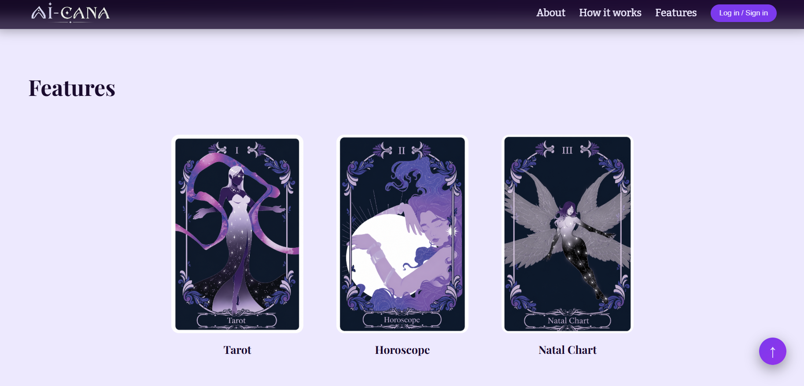
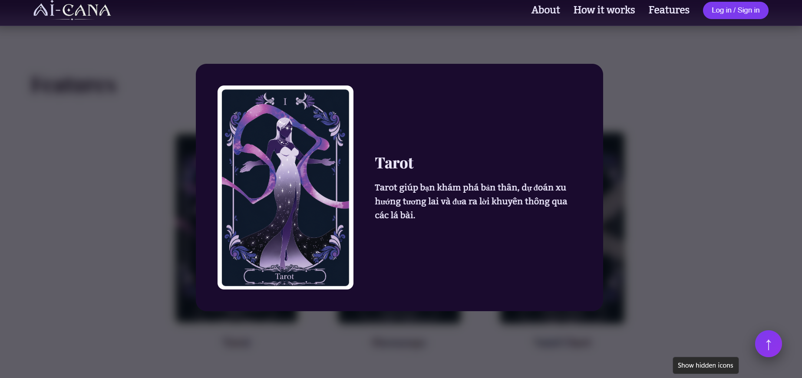
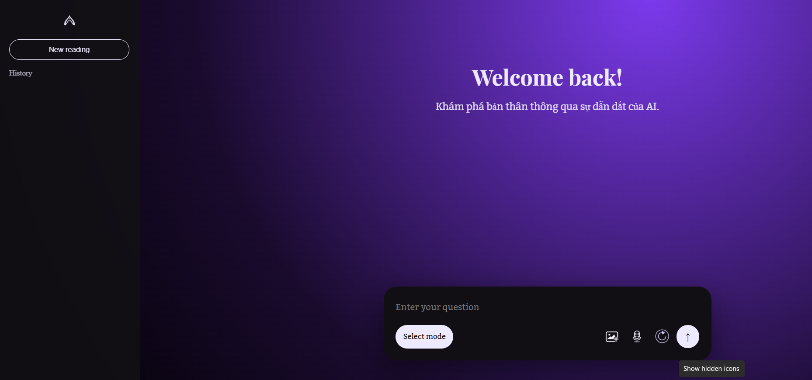
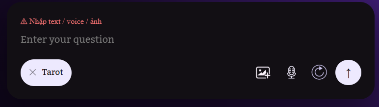
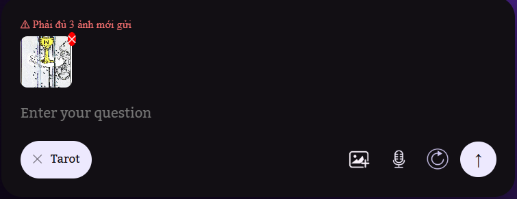

# Báo cáo tiến độ đồ án Lập trình Web
Môn: NT208.Q21.ANTN<br>
Lớp: ATTN2024<br>
GVHD: ThS. Trần Tuấn Dũng<br>
Sinh viên thực hiện: Trang Tuấn Anh (24520131) - Nguyễn Minh Phúc Khang (24520758)

--- 

# Back end: Hệ thống Tarot Multimodal API

## 1. Tổng quan hệ thống

Phần backend của dự án là một **REST API đa phương thức (multimodal)** dành cho ứng dụng đọc bài Tarot. Hệ thống cho phép người dùng gửi câu hỏi bằng văn bản, giọng nói, hoặc ảnh chụp lá bài thật để nhận được một bài đọc Tarot được sinh ra bởi trí tuệ nhân tạo.

Backend đảm nhận toàn bộ phần "nặng" của ứng dụng: xử lý file media, nhận dạng ảnh, chuyển đổi giọng nói thành văn bản, truy xuất kiến thức từ cơ sở dữ liệu vector, rồi gọi mô hình ngôn ngữ lớn (LLM) để sinh ra lời đọc bài tự nhiên và có ý nghĩa. Ngoài chức năng đọc bài cơ bản, hệ thống còn có hàng loạt tính năng mở rộng như đọc bài cặp đôi, nhật ký giấc mơ, lá bài hàng ngày, và "viên nang thời gian" để người dùng lưu lại dự đoán cho tương lai.

Hệ thống được viết bằng **Python 3.10+** và chạy trên framework **FastAPI**, phục vụ qua HTTP (REST) và WebSocket.

---

## 2. Kiến trúc tổng thể

Nhìn tổng thể, backend được tổ chức theo mô hình **layered architecture** (kiến trúc phân lớp), trong đó mỗi lớp chỉ biết lớp bên dưới nó và không phụ thuộc ngược lại.

```
┌─────────────────────────────────────────────────────────────┐
│                    HTTP / WebSocket Layer                    │
│               FastAPI (src/main.py) — ~60 endpoints         │
└──────────────────────────┬──────────────────────────────────┘
                           │
┌──────────────────────────▼──────────────────────────────────┐
│                     Service / Logic Layer                    │
│   TarotPipeline   |  Advanced Features  |  Auth Service     │
│   (src/pipeline)  |  (src/advanced/*)   |  (src/auth/)      │
└──────────┬──────────────────┬───────────────────────────────┘
           │                  │
┌──────────▼──────┐  ┌────────▼──────────────────────────────┐
│   AI/ML Layer   │  │              Data Layer                │
│  ┌───────────┐  │  │  SQLite (via SQLAlchemy ORM)           │
│  │ ASR       │  │  │  FAISS vision index                    │
│  │ Vision    │  │  │  FAISS RAG index                       │
│  │ RAG       │  │  │  Alembic migrations                    │
│  │ LLM       │  │  └────────────────────────────────────────┘
│  │ Emotion   │  │
│  └───────────┘  │
└─────────────────┘
```

Điểm đáng chú ý trong thiết kế này là **luồng xử lý chính** (TarotPipeline) hoàn toàn **tách biệt** với lớp API. Điều này giúp dễ dàng viết test cho pipeline mà không cần khởi động server.

Một đặc điểm quan trọng khác là hệ thống luôn có **fallback** ở từng bước: nếu faster-whisper không có thì dùng transformers; nếu FAISS index chưa được build thì trả về snippet mẫu; nếu Ollama không chạy thì dùng kết quả deterministic. Nhờ đó hệ thống vẫn hoạt động được kể cả khi một số phụ thuộc nặng chưa được cài đặt đầy đủ — điều này rất hữu ích trong môi trường demo hoặc khi phát triển.

---

## 3. Công nghệ và thư viện sử dụng

Bảng dưới đây liệt kê các thư viện chính và lý do chọn chúng:

| Thư viện | Phiên bản | Mục đích sử dụng |
|---|---|---|
| **FastAPI** | ≥0.115 | Framework chính để xây dựng REST API và WebSocket. Chọn vì hỗ trợ async native, tự sinh OpenAPI docs, validation bằng Pydantic tích hợp sẵn. |
| **Uvicorn** | ≥0.30 | ASGI server để chạy FastAPI trong production và development. |
| **SQLAlchemy** | ≥2.0 | ORM để tương tác với cơ sở dữ liệu. Sử dụng cú pháp `Mapped[]` mới của SQLAlchemy 2.0 với type hints đầy đủ. |
| **Alembic** | ≥1.13 | Quản lý migration schema cơ sở dữ liệu theo phiên bản. |
| **PyJWT** | ≥2.8 | Tạo và xác thực JSON Web Token cho phần authentication. |
| **APScheduler** | ≥3.10 | Chạy các tác vụ nền theo lịch (rating reminder, oracle report, archetype update). |
| **faster-whisper** | ≥1.1.0 | Nhận dạng giọng nói (ASR) tốc độ cao, ưu tiên tiếng Việt/Anh. Là lựa chọn ưu tiên vì nhanh hơn transformers gốc đáng kể. |
| **Transformers** | ≥4.41 | Fallback ASR khi faster-whisper không khả dụng, dùng Whisper của OpenAI qua HuggingFace. |
| **open-clip-torch** | ≥2.24 | Model ViT-B-32 để tạo embedding ảnh lá bài cho bài toán nhận dạng (vision retrieval). |
| **faiss-cpu** | ≥1.7.4 | Thư viện tìm kiếm vector (Approximate Nearest Neighbor) dùng cho cả vision index và RAG index. |
| **sentence-transformers** | ≥3.0 | Tạo embedding văn bản cho RAG (dùng model `all-MiniLM-L6-v2`). |
| **OpenAI SDK** | ≥1.30 | Gọi OpenAI API để sinh lời đọc bài (LLM generation). |
| **Requests** | ≥2.31 | Gọi Ollama API (local LLM) như một fallback khi không có OpenAI key. |
| **Pillow / OpenCV** | ≥10.0 / ≥4.8 | Xử lý ảnh trước khi đưa vào model nhận dạng. |
| **python-dotenv** | ≥1.0 | Load biến môi trường từ file `.env`. |
| **python-multipart** | ≥0.0.9 | Xử lý form data và file upload trong FastAPI. |
| **Gradio** | ≥4.44 | Giao diện demo nội bộ (không phải phần chính của API). |
| **Pytest** | ≥8.0 | Framework viết test tự động. |

---

## 4. Cấu trúc thư mục source code

```
src/
├── main.py              # Entry point: định nghĩa toàn bộ API endpoints (~60 routes)
├── pipeline/
│   └── tarot_pipeline.py   # Điều phối toàn bộ luồng AI (ASR → Vision → RAG → LLM)
├── auth/
│   ├── security.py     # Hash mật khẩu (PBKDF2), JWT encode/decode
│   ├── service.py      # Business logic: đăng ký, đăng nhập
│   └── deps.py         # FastAPI dependency injection cho auth
├── db/
│   ├── models.py       # Toàn bộ ORM models (15 bảng)
│   ├── session.py      # SQLAlchemy engine & session factory
│   ├── init_db.py      # Khởi tạo schema khi startup
│   ├── persistence.py  # Lưu kết quả đọc bài vào DB
│   └── seed.py         # Seed dữ liệu 78 lá bài Tarot
├── asr/
│   └── transcribe.py   # Nhận dạng giọng nói (faster-whisper + transformers fallback)
├── vision/
│   ├── embedder.py     # VisionEmbedder: OpenCLIP ViT-B-32
│   ├── predict_card.py # CardPredictor: nhận dạng lá bài từ ảnh
│   ├── preprocess.py   # Tiền xử lý ảnh (load, rotate)
│   └── index.py        # Load/query FAISS vision index
├── rag/
│   ├── build_index.py  # Build FAISS index từ knowledge base
│   └── retrieve.py     # RagRetriever: truy xuất snippet theo câu hỏi
├── llm/
│   ├── generate.py     # ReadingGenerator: sinh lời đọc bài qua LLM
│   └── prompts/        # Template prompt (reading_template.md, system.md)
├── advanced/
│   ├── affirmations.py         # Sinh lời khẳng định theo lá bài
│   ├── analytics_scheduler.py  # Scheduler cho archetype + oracle
│   ├── archetype_profiler.py   # Phân tích archetype người dùng
│   ├── community_room.py       # Phòng cộng đồng + moderation
│   ├── conversation.py         # Follow-up hội thoại theo session
│   ├── daily_card.py           # Lá bài hàng ngày + streak
│   ├── dream_journal.py        # Nhật ký giấc mơ
│   ├── duo_reading.py          # Đọc bài cặp đôi + WebSocket
│   ├── emotion_analysis.py     # Phân tích cảm xúc giọng nói
│   ├── oracle_reports.py       # Báo cáo oracle hàng tháng
│   ├── question_suggestions.py # Gợi ý câu hỏi tiếp theo
│   ├── rating_reminders.py     # Nhắc nhở đánh giá độ chính xác
│   ├── spread_recommender.py   # Gợi ý kiểu trải bài
│   └── time_capsule.py         # Viên nang thời gian
└── utils/
    ├── config.py       # Load config từ YAML + biến môi trường
    ├── io.py           # Các hàm tiện ích I/O
    ├── logging.py      # Cấu hình logger (loguru)
    ├── rate_limit.py   # In-memory rate limiter theo IP
    ├── timezone.py     # Xử lý timezone (Asia/Ho_Chi_Minh)
    └── validators.py   # Validator email, input
```

---

## 5. Module Authentication & Security

### 5.1 Cơ chế mật khẩu

Mật khẩu người dùng không được lưu dưới dạng plain text. Hệ thống dùng **PBKDF2-HMAC-SHA256** với 200.000 vòng lặp và salt ngẫu nhiên 16 bytes:

```python
def hash_password(password: str) -> str:
    salt = os.urandom(16)
    digest = hashlib.pbkdf2_hmac("sha256", password.encode("utf-8"), salt, 200_000)
    return f"pbkdf2_sha256${base64.b64encode(salt).decode()}${base64.b64encode(digest).decode()}"
```

Khi xác thực, hệ thống dùng `hmac.compare_digest()` để so sánh hash — hàm này so sánh theo **constant time** giúp tránh timing attack.

### 5.2 JWT Authentication

Sau khi đăng nhập thành công, server trả về một **JSON Web Token** được ký bằng thuật toán HS256. Token chứa `user_id`, `role`, thời điểm tạo (`iat`) và thời điểm hết hạn (`exp`). Thời gian hết hạn mặc định là 120 phút, có thể thay đổi qua biến môi trường `JWT_EXPIRE_MINUTES`.

```python
payload = {
    "sub": str(user_id),
    "role": role,
    "iat": int(now.timestamp()),
    "exp": int((now + timedelta(minutes=expire_minutes)).timestamp()),
}
return jwt.encode(payload, secret_key, algorithm="HS256")
```

Khi người dùng gọi các endpoint cần xác thực, token được gửi trong header `Authorization: Bearer <token>`. FastAPI sẽ dùng dependency injection (`Depends(get_current_user)`) để xác thực tự động trước khi endpoint được gọi.

### 5.3 Phân quyền

Hệ thống có hai vai trò: `member` (thành viên thường) và `admin` (quản trị viên). Admin có thể duyệt/từ chối bài đăng cộng đồng và xem hàng đợi kiểm duyệt. Với các tài nguyên cá nhân (profile, oracle report…), hệ thống kiểm tra thêm điều kiện "chỉ chủ sở hữu hoặc admin mới được xem":

```python
def _ensure_self_or_admin(current_user, target_user_id):
    if current_user.role == "admin":
        return
    if current_user.id != target_user_id:
        raise HTTPException(status_code=403, detail="access denied")
```

### 5.4 Rate Limiting

Để chống spam và brute-force, hệ thống có rate limiter in-memory theo IP. Endpoint đăng ký bị giới hạn **5 request/phút**, đăng nhập **10 request/phút**. Rate limiter được implement bằng Python dict + `time.monotonic()`, không cần Redis — phù hợp cho deployment đơn server.

---

## 6. AI Pipeline — Luồng xử lý chính

Đây là phần kỹ thuật nặng nhất của dự án. Mỗi request đọc bài Tarot đi qua năm bước xử lý tuần tự, được tổng hợp lại trong class `TarotPipeline`.

### 6.1 ASR — Nhận dạng giọng nói

**Module:** `src/asr/transcribe.py`

Người dùng có thể gửi file audio thay vì (hoặc kèm theo) câu hỏi bằng văn bản. Hệ thống xử lý audio theo các bước sau:

**Bước 1 — Chuyển đổi định dạng:** Nếu file không phải WAV, hệ thống gọi `ffmpeg` để convert về WAV mono 16kHz. Nếu `ffmpeg` không có sẵn, hệ thống thêm warning và bỏ qua audio.

**Bước 2 — Nhận dạng (hai tầng fallback):**

- **Ưu tiên 1 — faster-whisper:** Sử dụng model `large-v3` (có thể cấu hình). faster-whisper là implementation của Whisper được tối ưu hóa dùng CTranslate2, nhanh hơn gốc khoảng 4–8 lần. Hệ thống hỗ trợ chế độ `auto_vi_en`: chạy transcribe riêng cho cả tiếng Việt và tiếng Anh, rồi chọn kết quả có `avg_logprob` cao hơn.

- **Fallback — transformers Whisper:** Nếu faster-whisper không cài hoặc lỗi, hệ thống dùng `openai/whisper-small` qua HuggingFace pipeline, xử lý audio dưới dạng numpy array.

Model được cache bằng `@lru_cache(maxsize=1)` để không load lại model mỗi lần gọi.

### 6.2 Vision — Nhận dạng lá bài

**Module:** `src/vision/`

Đây là phần độc đáo nhất của dự án. Thay vì dùng classifier truyền thống, hệ thống dùng phương pháp **image retrieval** dựa trên embedding.

**Quy trình:**

1. **Tiền xử lý:** Ảnh được load bằng Pillow, chuyển sang RGB, resize về kích thước chuẩn.
2. **Tạo embedding:** Model **OpenCLIP ViT-B-32** (pretrained trên LAION-2B) được dùng để encode ảnh thành vector 512 chiều.
3. **Xử lý lá ngược:** Để phát hiện lá ngược (reversed), ảnh được xử lý **hai lần** — một lần bình thường và một lần xoay 180°. Kết quả của lần xoay 180° sẽ được đổi orientation (nếu tìm được "upright" thì map sang "reversed" và ngược lại).
4. **Tìm kiếm FAISS:** Cả hai vector được tìm kiếm trên FAISS index — một index đã được build sẵn từ ảnh của 78 lá bài Tarot. Kết quả top-K từ cả hai lần search được hợp nhất và sắp xếp lại theo score.
5. **Tính confidence:** Confidence được tính dựa trên **khoảng cách giữa top-1 và top-2**: margin càng lớn thì confidence càng cao. Công thức: `confidence = (top1_score - top2_score + 0.2) / 0.8`.

Nếu FAISS index chưa được build, `CardPredictor` chạy ở chế độ fallback và trả về danh sách ứng viên mặc định từ Major Arcana.

### 6.3 RAG — Truy xuất tri thức

**Module:** `src/rag/retrieve.py`

RAG (Retrieval-Augmented Generation) là kỹ thuật cung cấp ngữ cảnh liên quan cho LLM trước khi sinh câu trả lời, giúp câu trả lời chính xác và có chiều sâu hơn.

**Quy trình:**

1. Model `sentence-transformers/all-MiniLM-L6-v2` encode câu hỏi (kết hợp text + transcript) thành vector 384 chiều.
2. FAISS tìm kiếm các snippet gần nhất trong knowledge base — bao gồm mô tả chi tiết về từng lá bài, ý nghĩa theo orientation, và các chủ đề liên quan.
3. Lọc theo `card_name` và `orientation` để chỉ lấy snippet phù hợp với các lá bài đã nhận diện được.
4. Nếu không đủ snippet sau khi lọc, hệ thống có nhiều tầng fallback để đảm bảo luôn có tối thiểu `rag_min_snippets` đoạn nội dung (mặc định là 3).

`RagRetriever` cũng cung cấp phương thức `list_known_cards()` — dùng bởi `TarotPipeline` để lấy danh sách tên lá bài khi cần random draw.

### 6.4 LLM — Sinh câu trả lời

**Module:** `src/llm/generate.py`

Đây là bước cuối cùng trong pipeline, nơi LLM tổng hợp tất cả thông tin để sinh ra lời đọc bài. Hệ thống có **ba tầng fallback**:

1. **OpenAI API:** Ưu tiên đầu tiên nếu có `OPENAI_API_KEY`. Dùng các model như `gpt-4o`, `gpt-4o-mini`... Lời đọc bài chất lượng cao, ngữ điệu tự nhiên.

2. **Ollama (local LLM):** Nếu OpenAI không có, hệ thống gọi Ollama HTTP API (`localhost:11434`). Model mặc định là `qwen2.5:3b-instruct`. Đây là lựa chọn phù hợp cho demo offline mà không cần kết nối internet hay phí API.

3. **Deterministic fallback:** Nếu cả hai đều không khả dụng, hệ thống tự sinh ra một lời đọc bài theo template đơn giản dựa trên tên và orientation của các lá bài. Không cần LLM, luôn hoạt động.

Prompt được thiết kế cẩn thận trong `src/llm/prompts/`, bao gồm system prompt và template đọc bài, giúp LLM hiểu ngữ cảnh ứng dụng và sinh ra kết quả phù hợp về giọng điệu.

Hệ thống theo dõi thời gian sinh (`time.monotonic()`) và thêm warning nếu quá ngưỡng `SLOW_GENERATION_WARNING_SECONDS` (mặc định 45 giây).

### 6.5 Emotion Analysis — Phân tích cảm xúc

**Module:** `src/advanced/emotion_analysis.py`

Nếu người dùng gửi audio, hệ thống phân tích thêm **cảm xúc giọng nói** dựa trên đặc trưng âm thanh (pitch, energy, speech rate…). Kết quả (`emotion_state` và `emotion_signal`) được đưa vào prompt cho LLM, giúp lời đọc bài phản ánh được trạng thái cảm xúc thực tế của người hỏi.

---

## 7. TarotPipeline — Điều phối toàn bộ luồng

**Module:** `src/pipeline/tarot_pipeline.py`

`TarotPipeline` là class trung tâm kết nối tất cả các module AI lại với nhau. Khi được khởi tạo, nó load tất cả model và index cần thiết:

```python
class TarotPipeline:
    def __init__(self, ...):
        self.card_predictor = CardPredictor(...)  # Vision
        self.rag_retriever = RagRetriever(...)    # RAG
        self.reader = ReadingGenerator()           # LLM
```

Pipeline singleton được cache lại ở cấp module API (`_pipeline: TarotPipeline | None`) — chỉ khởi tạo một lần khi request đầu tiên đến, tránh tốn thời gian load model mỗi request.

Phương thức `run_pipeline()` thực hiện tuần tự:

```
1. transcribe_audio()          → transcript, asr_warnings
2. analyze_voice_emotion()     → emotion_state, emotion_signal
3. _build_card_outputs()       → cards[] (vision recognition)
   hoặc _draw_random_cards()   → cards[] (nếu random_draw=True)
4. _collect_snippets()         → rag_snippets[]
5. reader.generate()           → final_answer, llm_model
6. Trả về dict kết quả đầy đủ
```

Kết quả trả về bao gồm: `question`, `transcript`, `spread_type`, `cards`, `rag_snippets`, `emotion_state`, `emotion_signal`, `final_answer`, `llm_model`, và `warnings`.

---

## 8. Database & Persistence

**Module:** `src/db/`

### 8.1 Công nghệ

Hệ thống dùng **SQLite** làm database mặc định (file `data/app.db`), kết nối qua **SQLAlchemy 2.0** ORM. Có thể chuyển sang PostgreSQL bằng cách đổi `DATABASE_URL` mà không cần sửa code.

Toàn bộ model định nghĩa bằng cú pháp `Mapped[]` mới của SQLAlchemy 2.0, cho phép IDE hỗ trợ type checking đầy đủ:

```python
class User(Base):
    __tablename__ = "users"
    id: Mapped[int] = mapped_column(Integer, primary_key=True, autoincrement=True)
    email: Mapped[str] = mapped_column(String(255), unique=True, nullable=False)
    password_hash: Mapped[str] = mapped_column(String(255), nullable=False)
    role: Mapped[str] = mapped_column(String(32), nullable=False, default="member")
```

### 8.2 Schema — 15 bảng chính

| Bảng | Mục đích |
|---|---|
| `users` | Thông tin người dùng (email, password hash, role) |
| `tarot_cards` | Danh mục 78 lá bài Tarot (reference data, seed khi startup) |
| `reading_sessions` | Mỗi lần đọc bài tạo một session; lưu câu hỏi, transcript, emotion |
| `recognized_cards` | Các lá bài được nhận diện trong một session (có orientation, confidence) |
| `readings` | Lời đọc bài được sinh ra bởi LLM, gắn với session |
| `conversation_turns` | Các lượt hội thoại follow-up theo từng session |
| `rating_reminders` | Lịch nhắc nhở người dùng đánh giá độ chính xác sau N ngày |
| `user_archetype_profiles` | Hồ sơ archetype được tính từ lịch sử đọc bài |
| `oracle_reports` | Báo cáo phân tích hàng tháng theo chu kỳ |
| `duo_sessions` | Phiên đọc bài cặp đôi |
| `duo_participants` | Người tham gia trong duo session |
| `duo_cards` | Lá bài của từng người trong duo session |
| `duo_readings` | Kết quả đọc bài chung của duo session |
| `community_posts` | Bài đăng cộng đồng (cần kiểm duyệt) |
| `community_interpretations` | Lời giải thích của cộng đồng cho bài đăng |
| `community_votes` | Vote cho interpretation (unique constraint: 1 user = 1 vote/interpretation) |
| `community_moderation_logs` | Nhật ký kiểm duyệt của admin |
| `dream_entries` | Nhật ký giấc mơ |
| `daily_cards` | Lá bài hàng ngày (unique constraint: 1 user = 1 lá/ngày) |
| `time_capsules` | Viên nang thời gian (dự đoán khóa đến ngày tương lai) |

### 8.3 Migration với Alembic

Hệ thống dùng **Alembic** để quản lý migration. Có hai migration file:

- `20260410_000001_initial_advanced.py`: Schema ban đầu đầy đủ
- `20260428_000002_daily_card_time_capsule.py`: Thêm bảng `daily_cards` và `time_capsules`

Khi startup, hàm `initialize_database_if_needed()` tự động tạo bảng nếu chưa có và seed dữ liệu 78 lá bài — không cần chạy migration thủ công khi deploy lần đầu.

### 8.4 Integrity Constraints

Database có nhiều `CheckConstraint` để đảm bảo tính nhất quán:

```sql
-- Ví dụ một số constraint:
CHECK status IN ('pending', 'processing', 'completed', 'failed')   -- reading_sessions
CHECK orientation IN ('upright', 'reversed')                        -- recognized_cards, daily_cards
CHECK status IN ('sealed', 'revealed', 'verified')                  -- time_capsules
CHECK accuracy_score IS NULL OR (accuracy_score >= 1 AND accuracy_score <= 5)
```

---

## 9. Các tính năng nâng cao (Advanced Features)

### 9.1 Conversational Follow-up

**Endpoint:** `POST /api/sessions/{session_id}/followup`

Sau khi nhận được kết quả đọc bài, người dùng có thể tiếp tục đặt câu hỏi thêm liên quan đến session đó. Hệ thống lưu toàn bộ lịch sử hội thoại vào bảng `conversation_turns` (với `role`: `user` / `assistant`), rồi gọi LLM với context đầy đủ để trả lời coherent.

**Endpoint:** `GET /api/sessions/{session_id}/conversation` — lấy lại toàn bộ lịch sử (giới hạn 200 lượt).

### 9.2 Archetype Profiler

**Endpoint:** `GET /api/users/{user_id}/archetype_profile`

Dựa vào lịch sử đọc bài của người dùng, hệ thống phân tích và xác định **"Soul Card"** (lá bài đặc trưng) cùng các từ khóa nổi bật nhất trong các phiên đọc. Kết quả được lưu vào `user_archetype_profiles` và cập nhật tự động mỗi tuần qua scheduler.

### 9.3 Oracle Reports

**Endpoint:** `GET /api/users/{user_id}/oracle_reports`

Mỗi tháng, scheduler tạo một báo cáo oracle tổng hợp cho người dùng, phân tích xu hướng trong tháng đó: lá bài xuất hiện nhiều nhất, chủ đề lặp lại, đánh giá từ người dùng… Báo cáo được ghi vào bảng `oracle_reports`.

### 9.4 Spread Recommender & Question Suggestions

**Spread Recommender** (`POST /api/spread/recommend`): Phân tích câu hỏi của người dùng và gợi ý kiểu trải bài phù hợp nhất (ví dụ: nếu câu hỏi về tình cảm thì gợi ý trải "Relationship Spread").

**Question Suggestions** (`GET /api/question_suggestions`): Gợi ý các câu hỏi tiếp theo dựa trên lịch sử đọc bài của người dùng — giúp người dùng khai thác sâu hơn những chủ đề đang quan tâm.

### 9.5 Duo Reading (WebSocket)

**Module:** `src/advanced/duo_reading.py`

Đây là tính năng cho phép **hai người cùng tham gia một buổi đọc bài** và nhận một lời đọc chung. Luồng hoạt động:

1. Người dùng A tạo phiên (`POST /api/duo/sessions`) → nhận `invite_code`.
2. Người dùng B join bằng invite code (`POST /api/duo/sessions/join_by_invite`).
3. Cả hai upload ảnh lá bài của mình riêng biệt.
4. Khi cả hai đã sẵn sàng, pipeline sinh lời đọc chung.

Cả hai người được thông báo realtime qua **WebSocket** (`/ws/duo/{duo_session_id}`). Một `WebSocketConnectionManager` quản lý danh sách kết nối đang mở cho mỗi phiên, tự động broadcast sự kiện (`duo_joined`, `duo_updated`, `duo_created`) đến tất cả client đang kết nối.

Authentication cho WebSocket được thực hiện qua query parameter token khi mở kết nối.

### 9.6 Community Room

**Module:** `src/advanced/community_room.py`

Người dùng có thể chia sẻ câu hỏi và kết quả đọc bài của mình ra cộng đồng để nhận thêm góc nhìn từ người khác. Tính năng bao gồm:

- Tạo bài đăng (mặc định ở trạng thái `pending`, chờ admin duyệt)
- Thêm lời giải thích (interpretation) cho bài đăng của người khác
- Vote cho interpretation hay nhất
- Người đăng có thể "resonate" với interpretation nào đó
- Admin có thể approve/reject bài đăng qua endpoint kiểm duyệt

Hệ thống dùng `anonymous_alias` để hiển thị tên ẩn danh thay vì email thật, bảo vệ quyền riêng tư người dùng.

### 9.7 Dream Journal

**Module:** `src/advanced/dream_journal.py`

Người dùng có thể ghi lại giấc mơ bằng text hoặc audio. Hệ thống:

- Transcribe audio (nếu có) bằng ASR module
- Phân tích và trích xuất các biểu tượng (`symbols`) trong giấc mơ
- Map các biểu tượng sang các Arcana Tarot liên quan (`mapped_arcana`)
- Trả về danh sách lá bài có kết nối với nội dung giấc mơ

Kết quả lưu vào `dream_entries`, người dùng có thể xem lại lịch sử.

### 9.8 Daily Card & Streak

**Module:** `src/advanced/daily_card.py`

Tính năng gamification giữ chân người dùng quay lại hàng ngày:

- Mỗi ngày người dùng rút **một lá bài ngẫu nhiên** (giới hạn 1 lá/user/ngày, enforce bằng unique constraint trong DB)
- Người dùng có thể ghi lại **mood trước** (`mood_pre`) khi rút bài và **mood sau** (`mood_post`) cùng ghi chú phản ánh (`reflection`) vào cuối ngày
- Hệ thống tự động tính **streak** (chuỗi ngày liên tiếp rút bài)
- `GET /api/daily-card/streak` trả về streak hiện tại và một số thống kê
- `GET /api/daily-card/history` lấy lịch sử tối đa 180 ngày gần nhất

Mỗi lá bài hàng ngày đi kèm một **affirmation** (câu khẳng định tích cực) được sinh deterministically.

### 9.9 Time Capsule

**Module:** `src/advanced/time_capsule.py`

Người dùng có thể tạo một "viên nang thời gian" để lưu lại dự đoán hiện tại và chỉ được mở ra vào một ngày trong tương lai:

```
Tạo capsule → [trạng thái: sealed] → đến ngày reveal_at → Mở capsule [revealed]
           → Đánh giá độ chính xác [verified]
```

Capsule lưu câu hỏi, lời tiên đoán, danh sách lá bài, và thời điểm mở khóa. Khi đến ngày, người dùng mới được phép mở (`POST /api/time-capsules/{id}/reveal`). Sau khi xem, người dùng đánh giá độ chính xác từ 1–5 (`POST /api/time-capsules/{id}/verdict`).

Scheduler chạy mỗi 15 phút để tự động đánh dấu các capsule đã đến ngày mở.

### 9.10 Card Affirmation

**Endpoint:** `GET /api/affirmations/{card_name}?orientation=upright`

Endpoint công khai (không cần auth), sinh ra câu affirmation cho một lá bài cụ thể theo orientation. Câu affirmation được tạo theo cách deterministic (không gọi LLM) dựa trên từ khóa của lá bài — đảm bảo phản hồi nhanh và nhất quán, phù hợp dùng cho widget trên frontend.

---

## 10. Background Scheduler

**Module:** `src/advanced/analytics_scheduler.py`, `src/advanced/rating_reminders.py`

Hệ thống có các tác vụ chạy nền được quản lý bởi **APScheduler** (Advanced Python Scheduler). Scheduler được khởi động và dừng trong `lifespan` của FastAPI:

```python
@asynccontextmanager
async def lifespan(_app: FastAPI):
    initialize_database_if_needed(seed_reference_data=True)
    start_rating_scheduler()
    start_analytics_scheduler()
    yield
    stop_analytics_scheduler()
    stop_rating_scheduler()
```

Danh sách các job định kỳ:

| Job | Lịch chạy | Mô tả |
|---|---|---|
| Rating Reminder Check | Mỗi 5 phút | Kiểm tra xem có reminder nào đến hạn không và gửi thông báo |
| Archetype Update | Thứ 2, 02:00 | Tính lại archetype profile cho tất cả người dùng có đủ lịch sử |
| Oracle Report | Ngày 1 hàng tháng, 03:00 | Tạo báo cáo oracle tháng trước cho từng người dùng |
| Time Capsule Auto-reveal | Mỗi 15 phút | Đánh dấu capsule đã đến ngày mở là `notified` |

Tất cả thời gian đều được xử lý theo **timezone** của ứng dụng (mặc định `Asia/Ho_Chi_Minh`), cấu hình qua `APP_TIMEZONE`.

---

## 11. Thiết kế API (REST Endpoints)

Toàn bộ API được định nghĩa trong `src/main.py`. Hệ thống có khoảng **60 endpoints** được tổ chức theo nhóm chức năng:

### Nhóm System

| Method | Path | Mô tả |
|---|---|---|
| GET | `/` | Kiểm tra server đang chạy |
| GET | `/api/health` | Health check đầy đủ: version, DB status, timezone |

### Nhóm Authentication

| Method | Path | Mô tả |
|---|---|---|
| POST | `/api/auth/register` | Đăng ký tài khoản (rate limited: 5/min) |
| POST | `/api/auth/login` | Đăng nhập, nhận JWT token (rate limited: 10/min) |
| GET | `/api/auth/me` | Lấy thông tin user hiện tại (cần auth) |

### Nhóm Reading Core

| Method | Path | Mô tả |
|---|---|---|
| POST | `/api/ask` | Đọc bài qua JSON body |
| POST | `/api/ask_with_media` | Đọc bài qua multipart form (text + audio + images) — endpoint chính |
| POST | `/api/ask_with_image` | Đọc bài chỉ với ảnh |

### Nhóm Session & Conversation

| Method | Path | Mô tả |
|---|---|---|
| POST | `/api/sessions/{id}/followup` | Gửi câu hỏi tiếp theo |
| GET | `/api/sessions/{id}/conversation` | Lấy lịch sử hội thoại |
| GET | `/api/question_suggestions` | Gợi ý câu hỏi |
| POST | `/api/spread/recommend` | Gợi ý kiểu trải bài |
| POST | `/api/readings/{id}/rating` | Đánh giá độ chính xác |

### Nhóm User & Analytics

| Method | Path | Mô tả |
|---|---|---|
| GET | `/api/users/{id}/archetype_profile` | Hồ sơ archetype (cần auth) |
| GET | `/api/users/{id}/oracle_reports` | Danh sách oracle reports (cần auth) |
| GET | `/api/users/{id}/pending_ratings` | Các rating còn chờ |

### Nhóm Duo Reading

| Method | Path | Mô tả |
|---|---|---|
| POST | `/api/duo/sessions` | Tạo phiên duo |
| POST | `/api/duo/sessions/{id}/join` | Join bằng session ID |
| POST | `/api/duo/sessions/join_by_invite` | Join bằng invite code |
| POST | `/api/duo/sessions/{id}/card` | Upload lá bài của mình |
| GET | `/api/duo/sessions/{id}` | Xem trạng thái phiên |
| WS | `/ws/duo/{id}` | WebSocket realtime |

### Nhóm Community

| Method | Path | Mô tả |
|---|---|---|
| POST | `/api/community/posts` | Tạo bài đăng |
| GET | `/api/community/feed` | Feed cộng đồng (có pagination) |
| POST | `/api/community/posts/{id}/interpretations` | Thêm lời giải |
| POST | `/api/community/interpretations/{id}/vote` | Vote |
| POST | `/api/community/interpretations/{id}/resonate` | Resonate |
| GET | `/api/admin/community/moderation_queue` | Hàng đợi kiểm duyệt (admin) |
| POST | `/api/admin/community/posts/{id}/approve` | Duyệt bài (admin) |
| POST | `/api/admin/community/posts/{id}/reject` | Từ chối bài (admin) |

### Nhóm Daily Card, Dream, Time Capsule, Affirmation

| Method | Path | Mô tả |
|---|---|---|
| GET/POST | `/api/daily-card/*` | Quản lý lá bài hàng ngày |
| GET/POST | `/api/dreams/*` | Nhật ký giấc mơ |
| GET/POST | `/api/time-capsules/*` | Viên nang thời gian |
| GET | `/api/affirmations/{card_name}` | Lấy câu affirmation (public) |

---

## 12. Middleware & Cross-cutting Concerns

### Request ID Middleware

Mỗi request được gán một ID duy nhất (`x-request-id` trong header hoặc tự sinh UUID). ID này được đính vào response header và các log message, giúp dễ debug khi có lỗi:

```python
@app.middleware("http")
async def request_id_middleware(request: Request, call_next):
    request_id = request.headers.get("x-request-id") or uuid.uuid4().hex[:16]
    request.state.request_id = request_id
    response = await call_next(request)
    response.headers["x-request-id"] = request_id
    return response
```

### CORS

Hệ thống cấu hình CORS để cho phép frontend gọi API. Origin được phép cấu hình qua biến môi trường `API_ALLOWED_ORIGINS` (mặc định `localhost:5173` cho Vite dev server). Trong production cần đổi lại cho đúng domain.

### Global Exception Handler

Mọi exception không được bắt sẽ bị xử lý bởi `_generic_exception_handler`, trả về response JSON chuẩn với `status 500` kèm `request_id` để tra cứu trong log — không để lộ stack trace ra ngoài.

### File Upload & Cleanup

Các file được upload (`image`, `audio`) được lưu tạm vào thư mục `tmp_uploads/` với tên ngẫu nhiên (UUID), xử lý xong thì **xóa ngay** trong block `finally` — đảm bảo không tích lũy file rác:

```python
try:
    # ... xử lý file
finally:
    for path in all_saved_paths:
        if os.path.exists(path):
            os.remove(path)
```

---

## 13. Cấu hình & Biến môi trường

Toàn bộ cấu hình được quản lý qua file `.env` (copy từ `.env.example`). Các biến quan trọng nhất:

| Biến | Giá trị mặc định | Mô tả |
|---|---|---|
| `DATABASE_URL` | `sqlite:///./data/app.db` | Chuỗi kết nối SQLAlchemy |
| `DB_ENABLED` | `true` | Bật/tắt lưu DB |
| `JWT_SECRET_KEY` | `change_me_...` | Khóa bí mật ký JWT — **PHẢI đổi trong production** |
| `JWT_EXPIRE_MINUTES` | `120` | Thời gian hết hạn token |
| `OPENAI_API_KEY` | (trống) | Key OpenAI để dùng GPT |
| `OLLAMA_ENABLED` | `true` | Bật Ollama làm LLM fallback |
| `OLLAMA_MODEL` | `qwen2.5:3b-instruct` | Model Ollama dùng |
| `ASR_MODEL_FASTER` | `large-v3` | Model faster-whisper |
| `ASR_LANGUAGE_MODE` | `auto_vi_en` | Chế độ ngôn ngữ ASR |
| `APP_TIMEZONE` | `Asia/Ho_Chi_Minh` | Timezone của app |
| `API_ALLOWED_ORIGINS` | `http://localhost:5173` | CORS whitelist |
| `SLOW_GENERATION_WARNING_SECONDS` | `45` | Ngưỡng cảnh báo LLM chậm |

---

## 14. Kết luận

Qua quá trình xây dựng phần backend của hệ thống Tarot Multimodal API, nhóm đã học được và ứng dụng được khá nhiều kiến thức thực tế:

Về **kiến trúc**, hệ thống được thiết kế theo kiến trúc phân lớp rõ ràng, tách biệt API layer, business logic, và data layer. Điều này giúp code dễ maintain và dễ test hơn. Mẫu thiết kế fallback (ASR, Vision, LLM đều có nhiều tầng dự phòng) giúp hệ thống **robust** ngay cả khi một số thành phần không sẵn sàng.

Về **công nghệ AI**, nhóm đã tích hợp được nhiều kỹ thuật học máy hiện đại: ASR với Whisper, image retrieval với OpenCLIP + FAISS, RAG với sentence-transformers, và LLM generation. Đây là những kỹ thuật đang được dùng rộng rãi trong các hệ thống AI thực tế hiện nay.

Về **tính năng**, backend hỗ trợ đầy đủ từ luồng cốt lõi đến các tính năng mở rộng phức tạp như WebSocket realtime (Duo Reading), gamification (Daily Card + Streak), và long-horizon prediction (Time Capsule). Tổng cộng có khoảng 60 API endpoints phục vụ đầy đủ nhu cầu của frontend.

Một điểm hạn chế cần cải thiện trong tương lai là rate limiter hiện tại dùng in-memory dict — nếu deploy nhiều instance sẽ không hoạt động chính xác, cần chuyển sang Redis. Ngoài ra, database SQLite tuy tiện cho development nhưng cần chuyển sang PostgreSQL khi scale lên.

---

# Front end: Giao diện Website AI-Cana

## 0. Giới thiệu
Tên gọi AI-Cana được xây dựng từ sự kết hợp giữa “AI” (Artificial Intelligence) và “Arcana” – thuật ngữ trong Tarot dùng để chỉ những lá bài mang ý nghĩa huyền bí và sâu sắc.

Tên gọi này thể hiện định hướng của dự án:
> Ứng dụng trí tuệ nhân tạo để giải mã và diễn giải các biểu tượng mang tính huyền học, đem lại trải nghiệm bói bài Tarot hiện đại và dễ tiếp cận hơn.

Website tập trung chính vào chức năng Tarot Reading, cho phép người dùng:
- Đặt câu hỏi liên quan đến cuộc sống (tình cảm, công việc, định hướng…)
- Trải bài Tarot trực tiếp trên giao diện
- Nhận kết quả phân tích tự động từ hệ thống AI

Ngoài ra, hệ thống cũng được thiết kế mở rộng cho các chức năng trong tương lai như:
- Horoscope (tử vi)
- Natal Chart (bản đồ sao)

Tuy nhiên, trong phạm vi hiện tại, nhóm tập trung phát triển và hoàn thiện trải nghiệm Tarot là chính.

## 1. Tổng quan
Frontend của hệ thống được xây dựng bằng **ReactJS**, theo mô hình component-based, giúp chia nhỏ giao diện thành các thành phần dễ tái sử dụng và quản lý. Cấu trúc code kết hợp giữa components và features, giúp tổ chức rõ ràng theo từng chức năng như landing, login và chat.

Giao diện sử dụng CSS Modules để quản lý style, đảm bảo không bị xung đột giữa các component. Thiết kế tập trung vào trải nghiệm người dùng, cho phép tương tác trực tiếp như nhập câu hỏi, chọn bài Tarot, upload hình ảnh và sử dụng voice.

Frontend chịu trách nhiệm hiển thị giao diện, xử lý input và giao tiếp với backend thông qua các API để nhận và hiển thị kết quả.

Cấu trúc thư mục frontend:
```bash
.
├── public # chứa tài nguyên tĩnh được serve trực tiếp
└── src # thư mục chính chứa toàn bộ src code
    ├── assets # chứa tài nguyên dùng trong UI (ảnh, data, icon,...)
    │   ├── images # chứa toàn bộ hình ảnh dùng cho giao diện
    │   │   ├── auth # dùng cho login page
    │   │   ├── chatpage # dùng cho Chat page
    │   │   └── landing # dùng cho Landing page
    │   │       └── draft
    │   └── tarot # chứa bài tarot và file json mapping tương ứng, phục vụ cho việc render ảnh từ BE
    │       └── tarot_json
    │           └── cards
    ├── components # các component tái sử dụng
    │   ├── common # component dùng chung nhiều nơi (button, modal, ...)
    │   ├── layout # navbar, footer 
    │   └── ui # component UI cụ thể của project (ChatBox, Sidebar, TarotBoard,...)   
    ├── features # chia code theo từng chức năng 
    │   ├── landing
    │   │   ├── AboutSection
    │   │   ├── FeaturesSection
    │   │   ├── HeroSection
    │   │   └── HowItWorksSection
    │   └── login
    ├── pages # các page chính 
    └── services # xử lý gọi API backend   
```
Website gồm 3 trang chính:
- Landing Page: giới thiệu hệ thống
- Login Page: xác thực người dùng
- Chat Page: nơi thực hiện trải bài Tarot

Hiện tại, hệ thống tập trung chủ yếu vào chức năng `Tarot`. Các tính năng như Horoscope (tử vi) và Natal Chart (bản đồ sao) được định hướng phát triển trong tương lai.

## 2. Landing page


Landing Page đóng vai trò giới thiệu tổng quan về sản phẩm.

Các thành phần chính:
- Hero Section: giới thiệu ngắn gọn về website
- About Section: mô tả mục đích và ý tưởng (chưa hoàn thành)
- How It Works: mô tả cách sử dụng (chưa hoàn thành)
- Features Section: liệt kê các chức năng chính 





Khi người dùng nhấp vào `Khám phá ngay` ở **Hero Section** hoặc `Log in/Sign in` trên **Navbar**, trang web sẽ đièu hướng sang **Login Page** để tiến hành xác thực  

*Nhóm chỉ mới hoàn thành khung sườn cho **Landing Page**, một vài section chưa hoàn thiện, hoặc đang trong quá trình sửa đổi để giúp trang web hoàn thiện hơn.*

## 3. Login page
**Login page** là nơi người dùng xác thực thông tin đăng nhập. Bao gồm các chức năng: đăng nhập, đăng ký, quên mật khẩu.


Việc xác thực người dùng nhằm mục đích lưu **Reading Session** và cá nhân hóa theo từng context của người dùng.

## 4. Chatpage
Là trang quan trọng nhất của hệ thống, bao gồm các thành phần:
- Side bar: có thể đóng mở khi nhấp vào logo bên trên nó, có nút tạo **Reading Session** mới, cũng như lưu lịch sử trải bài.
- Chat panel: bao gồm khung chat, hiển thị các câu người dùng đã hỏi trong session và nội dung lý giải của AI.
- Tarot pannel: hiển thị các lá bài đã được rút trong session đó (tên, trạng thái xuôi hay ngược).




Trong chatbox có các chức năng chính:
- Select mode: Chọn giữa Tarot - Holoscope - Natal chart
- Các nút chức năng khác như tải ảnh lên, vocie, reset nội dung và gửi.

Khi người dùng nhập sai / không đầy đủ thông tin, trang web sẽ hiển thị thông báo lỗi ngay trên chatbox:




## 5. Luồng hoạt động 
Hệ thống hoạt động dựa trên việc gọi API từ frontend đến backend. Các API sẽ được gọi tương ứng với chế độ người dùng sử dụng:


Khi người dùng chọn mode, nhập câu hỏi và nhấn gửi, giao diện rút bài sẽ hiển ra. Sau khi người dùng chọn đủ 3 lá. Hệ thống sẽ gọi API đến BE để tiến hành luận giải.


Kết quả tả về là thông điệp từ các lá bài trong Chat panel và thông tin về các lá bài đã rút trong Tarot panel:


Nếu người dùng chọn tải ảnh lên, hệ thống sẽ bỏ qua phần rút bài.

## 6. Hạn chế & khó khăn
Trong quá trình phát triển, nhóm gặp một số khó khăn chính:

1. Chuyển từ design sang code
Thiết kế trên Figma dễ nhưng khi implement:
- khó giữ layout chính xác
- responsive phức tạp
- một số thành phần bị lệch layout

2. Xử lý animation
- Khó tạo hiệu ứng mượt (flip bài, hover, transition)
- CSS thuần bị hạn chế
- Chưa tối ưu được trải nghiệm animation

3. Quản lý nhiều loại input
- Kết hợp: text, image, audio dẫn đến dễ xảy ra lỗi khi gọi sai API hoặc gửi nhiều request cùng lúc

4. Đồng bộ frontend – backend
- API thay đổi → frontend phải sửa theo
- Một số lỗi 422 do sai format request

## 7. Hướng phát triển
Trong tương lai, nhóm định hướng cải tiến hệ thống theo các hướng sau:

1. Cải tiến giao diện:
- Thiết kế tối giản hơn, mượt hơn
- Tích hợp nhiều object mang tính biểu tượng (phù thủy...) để tăng trải nghiệm người dùng và đơn giản hóa các nút chức năng
- Đồng bộ màu sắc, font chữ

2. Tối ưu animation:
Hiện tại nhóm chỉ dừng mới mức thiết kế layout, cấu trang web, trong tương lai, nhóm sẽ tích hợp thêm các framework animation (như framer motion) để tăng trải nghiệm cho người dùng.

Các cải tiến dự kiến:
- Thêm ảnh động vào Hero Section
- Hiệu ứng chuyển page
- Hiệu ứng khi click chuột
- Hiệu ứng cho các nút chức năng

3. Mở rộng chức năng
Hiện tại, nhóm chỉ mới dừng ở tarot, nhóm dự kiến thêm các chức năng khác như xem tử vi (holoscope) và bản đồ sao (natal chart) nếu đủ thời gian.

Ngoài ra, nhóm còn dự kiến phát triển tính năng **Tarot Streak** cho phép giữ chuỗi khi hằng nàgy rút bài tarot nhằm giữ chân người dùng.

*Báo cáo được viết dựa trên source code tại commit mới nhất, tháng 05/2026.*


