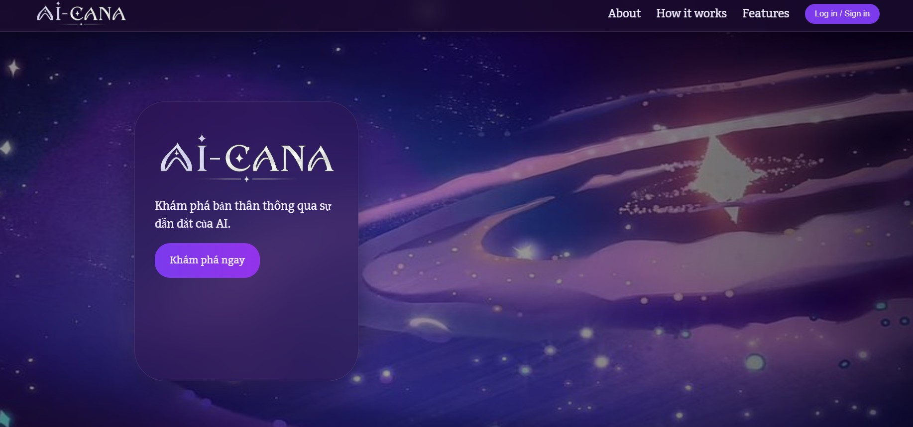
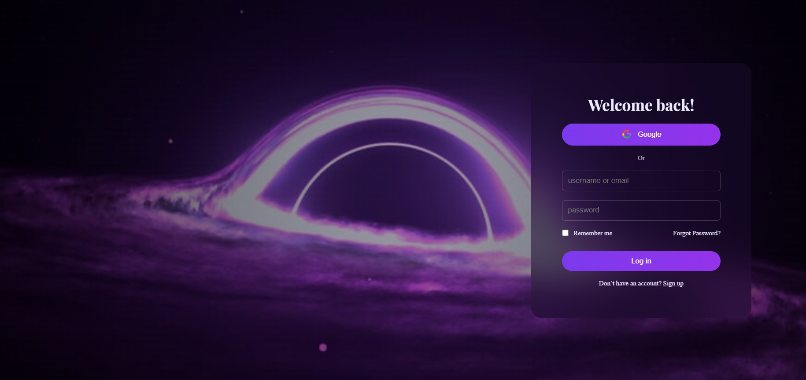
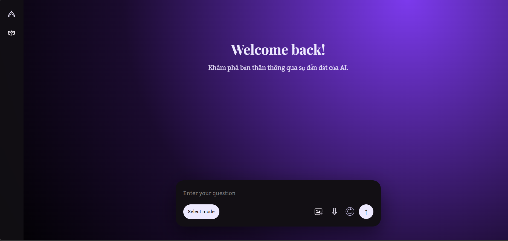
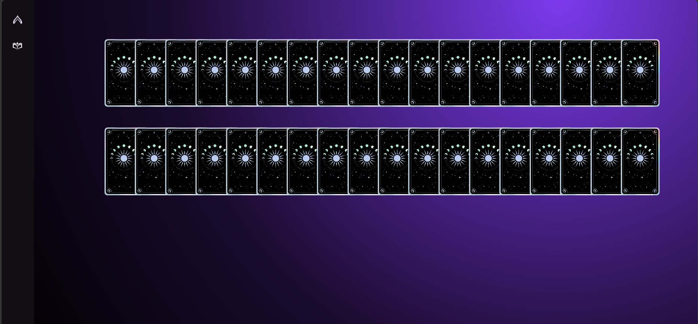
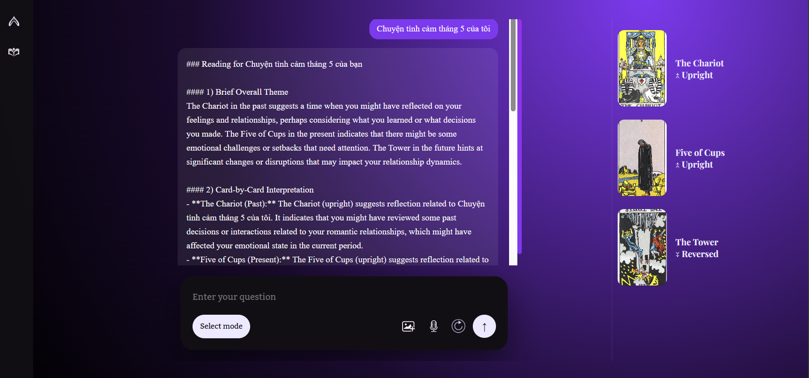
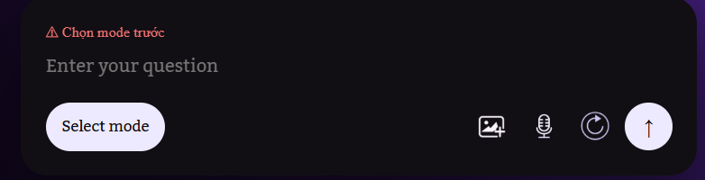
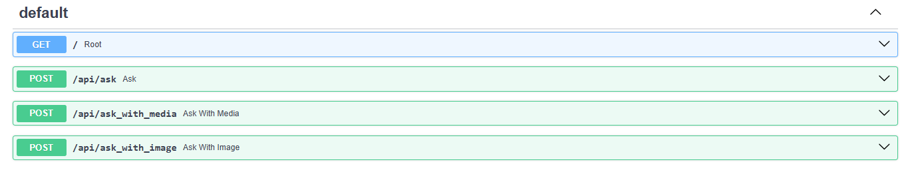

# Báo cáo tiến độ đồ án Lập trình Web
Môn: NT208.Q21.ANTN<br>
Lớp: ATTN2024<br>
GVHD: ThS. Trần Tuấn Dũng<br>
Sinh viên thực hiện: Trang Tuấn Anh (24520131) - Nguyễn Minh Phúc Khang (24520758)

---

# Báo cáo tiến độ kỹ thuật dự án AI-Cana

## 1. Tổng quan hiện trạng

AI-Cana là website hỗ trợ trải nghiệm Tarot bằng trí tuệ nhân tạo. Người dùng có thể xem giới thiệu sản phẩm, đăng nhập vào giao diện demo, đặt câu hỏi trong trang chat, chọn chế độ Tarot và nhận lời luận giải từ backend AI. Hệ thống được chia thành hai phần chính:

- **Backend:** FastAPI REST/WebSocket API do nhánh Tuấn Anh phụ trách, xử lý pipeline Tarot đa phương thức, database, authentication, các API nâng cao và tác vụ nền.
- **Frontend:** React/Vite web app từ nhánh Phúc Khang, tập trung vào giao diện Landing Page, Login Page và Chat Page cho trải nghiệm đọc bài Tarot.

Sau khi merge frontend từ nhánh `phuckhang`, trạng thái hiện tại là: frontend không còn conflict markers và đã build được bằng Vite; backend vẫn giữ theo nhánh Tuấn Anh, chưa bị ghi đè bởi phần frontend.

| Hạng mục | Trạng thái hiện tại | Ghi chú |
|---|---|---|
| Backend FastAPI | Đã có code nền v0.2.0 | Có 44 route HTTP và 1 route WebSocket trong `backend/src/main.py` |
| Core Tarot Reading | Đã có pipeline | Hỗ trợ text, image, audio, random draw, RAG và LLM fallback |
| Authentication backend | Đã có code | JWT, role `member/admin`, dependency auth |
| Database backend | Đã có nền tảng | SQLite, SQLAlchemy, Alembic, seed dữ liệu Tarot |
| Advanced backend features | Có code nhưng còn vấn đề layout | `src/advanced` và `src/auth` vẫn cần được đồng bộ đúng vào layout backend |
| Frontend UI | Đã merge bản Phúc Khang | Gồm Landing, Login, Chat |
| Frontend build | Đạt | `npm run build --prefix frontend` pass |
| Frontend - Backend integration | Đang tích hợp | Chat gọi được các endpoint đọc bài Tarot, auth frontend hiện vẫn mock |

### 1.1 Đối tượng sử dụng

| Đối tượng | Mục tiêu sử dụng | Nhu cầu chính |
|---|---|---|
| Khách truy cập website | Tìm hiểu sản phẩm | Xem Landing Page, đọc mô tả Tarot/Horoscope/Natal Chart, chuyển sang đăng nhập |
| Người dùng demo | Trải nghiệm đọc bài Tarot | Đăng nhập bằng tài khoản mock, vào Chat Page, nhập câu hỏi, chọn bài hoặc upload ảnh |
| Người dùng quan tâm Tarot | Nhận lời luận giải từ AI | Đặt câu hỏi tình cảm/công việc/định hướng, xem các lá bài và phần giải thích |
| Nhóm phát triển/demo | Kiểm thử đồ án | Chạy frontend, gọi backend, kiểm tra flow text/image/audio và các lỗi tích hợp |
| Quản trị/giảng viên chấm đồ án | Đánh giá sản phẩm | Xem giao diện, kiểm tra use case chính, đối chiếu frontend/backend |

Các nhóm người dùng nâng cao như cộng đồng, admin moderation, Duo Reading, Daily Card, Dream Journal và Time Capsule hiện có API/backend hoặc từng có UI trong nhánh khác, nhưng **không nằm trong frontend Phúc Khang đang được merge làm giao diện chính lần này**.

### 1.2 Các chức năng đã có trong codebase

| Nhóm chức năng | Chức năng cụ thể | Trạng thái |
|---|---|---|
| Landing Page | Navbar, Hero Section, About, How It Works, Features, Footer, Scroll-to-top | Có trong frontend hiện tại |
| Giới thiệu tính năng | Card giới thiệu Tarot, Horoscope, Natal Chart, mở modal mô tả | Có UI, Tarot là luồng chính |
| Login Page | Form đăng nhập, nút Google, remember me, forgot password link, sign up link | Có UI |
| Auth frontend | Mock login bằng `admin@gmail.com` / `123456`, lưu token giả vào localStorage | Có demo, chưa nối backend auth thật |
| Chat Page | Sidebar, header, khung chat, input, panel bài Tarot | Có UI |
| Chọn mode | Dropdown `Tarot`, `Horoscope`, `Natal Chart` | Có UI, hiện mới xử lý Tarot |
| Nhập câu hỏi | Text input và validation lỗi | Có |
| Upload ảnh | Cho phép chọn tối đa 3 ảnh, preview, xóa ảnh | Có |
| Voice input | Ghi âm bằng microphone và tạo audio preview | Có UI, service có nhánh gửi audio |
| Chọn bài thủ công | Hiển thị 36 lá úp, chọn đủ 3 lá rồi gọi API | Có |
| Gọi API Tarot text | `POST /api/ask` với `random_draw: true` | Có qua `tarotService.jsx` |
| Gọi API Tarot image | `POST /api/ask_with_image` với 3 ảnh | Có qua `tarotService.jsx` |
| Gọi API Tarot audio | `POST /api/ask_with_media` trong service | Có code service, flow ChatPage hiện chưa truyền audio sau bước chọn bài |
| Hiển thị kết quả | Render message assistant, danh sách lá bài, orientation xuôi/ngược, `final_answer` | Có |
| Build frontend | Vite production build | Pass |

### 1.3 Use case chính của hệ thống

| Mã | Actor | Use case | Luồng xử lý chính | Trạng thái |
|---|---|---|---|---|
| UC-01 | Khách | Xem trang giới thiệu | Mở `/`, xem Hero/About/How It Works/Features/Footer | Có |
| UC-02 | Khách | Xem mô tả từng chức năng | Click card Tarot/Horoscope/Natal Chart ở Features để mở modal | Có UI |
| UC-03 | Người dùng demo | Đăng nhập | Vào `/login`, nhập email/password mock, lưu token giả, chuyển sang `/chat` | Có demo |
| UC-04 | Người dùng demo | Nhập câu hỏi Tarot bằng text | Vào `/chat`, chọn mode Tarot, nhập câu hỏi, gửi | Có |
| UC-05 | Người dùng demo | Chọn 3 lá bài thủ công | Sau khi gửi text, giao diện chuyển sang board 36 lá úp, người dùng chọn 3 lá | Có |
| UC-06 | Người dùng demo | Nhận kết quả đọc bài text/random draw | Frontend gọi `/api/ask`, backend trả `cards` và `final_answer`, UI hiển thị kết quả | Có code, cần backend chạy |
| UC-07 | Người dùng demo | Đọc bài bằng ảnh | Chọn mode Tarot, upload đúng 3 ảnh, gửi thẳng lên `/api/ask_with_image` | Có code, cần backend chạy |
| UC-08 | Người dùng demo | Ghi âm câu hỏi | Click microphone, ghi âm, preview audio | Có UI |
| UC-09 | Người dùng demo | Gửi audio lên backend | Service có nhánh `/api/ask_with_media` | Có code service, cần nối lại flow ChatPage để truyền audio đầy đủ |
| UC-10 | Người dùng demo | Reset input | Bấm reset để xóa text, ảnh, audio, mode | Có |
| UC-11 | Nhóm phát triển | Build frontend | Chạy `npm run build --prefix frontend` | Pass |
| UC-12 | Nhóm phát triển | Kiểm tra tích hợp API | Chạy backend ở `127.0.0.1:8000`, thao tác Chat Page để gọi API | Đang tích hợp |

Use case cốt lõi nhất cho bản demo hiện tại là **UC-01 Landing**, **UC-03 Login mock**, **UC-04/UC-05/UC-06 đọc bài Tarot bằng text và chọn bài**, cùng **UC-07 đọc bài bằng ảnh**. Horoscope và Natal Chart hiện xuất hiện trong giao diện như định hướng sản phẩm, chưa có pipeline xử lý riêng.

---

## 2. Backend: Tarot Multimodal API

### 2.1 Công nghệ chính

Backend được xây dựng bằng Python và FastAPI. Các thư viện và công nghệ đang được sử dụng gồm:

| Nhóm | Công nghệ | Vai trò |
|---|---|---|
| Web API | FastAPI, Uvicorn | Xây dựng REST API và WebSocket |
| Database | SQLite, SQLAlchemy, Alembic | Lưu user, reading session, daily card, dream, community, time capsule |
| Auth | PyJWT, PBKDF2-HMAC-SHA256 | Đăng ký, đăng nhập, xác thực Bearer token |
| AI Vision | OpenCLIP, FAISS, Pillow/OpenCV | Nhận dạng lá bài Tarot từ ảnh |
| ASR | faster-whisper, transformers | Chuyển giọng nói thành văn bản |
| RAG | sentence-transformers, FAISS | Truy xuất ý nghĩa lá bài và snippet liên quan |
| LLM | OpenAI SDK, Ollama, deterministic fallback | Sinh lời luận giải Tarot |
| Scheduler | APScheduler | Rating reminder, analytics, oracle reports |
| Test | pytest | Kiểm thử migration, API, pipeline, feature |

Trong `backend/src/main.py`, phiên bản hiện tại là:

```python
APP_VERSION = "0.2.0"
```

### 2.2 Kiến trúc xử lý backend

Backend được tổ chức theo hướng phân lớp:

```text
Client / Frontend
      |
      v
FastAPI API Layer
      |
      v
Service / Feature Layer
      |
      +--> TarotPipeline
      +--> Auth service
      +--> Advanced features
      +--> Persistence
      |
      v
AI / Data Layer
      |
      +--> ASR
      +--> Vision retrieval
      +--> RAG retrieval
      +--> LLM generation
      +--> SQLite database
```

Ý tưởng chính là đưa các xử lý nặng như nhận dạng ảnh, nhận dạng giọng nói, truy xuất tri thức và sinh lời giải vào pipeline riêng. API layer nhận request, validate dữ liệu, lưu file tạm, gọi pipeline, lưu kết quả và trả response.

### 2.3 API surface hiện tại

Trong `backend/src/main.py`, hệ thống hiện có **44 route HTTP** và **1 route WebSocket**.

| Nhóm | Endpoint tiêu biểu | Trạng thái |
|---|---|---|
| System | `GET /`, `GET /api/health` | Đã có |
| Auth | `POST /api/auth/register`, `POST /api/auth/login`, `GET /api/auth/me` | Đã có backend, frontend hiện chưa nối thật |
| Core Reading | `POST /api/ask`, `POST /api/ask_with_media`, `POST /api/ask_with_image` | Đã có và được frontend Chat dùng |
| Conversation | `POST /api/sessions/{id}/followup`, `GET /api/sessions/{id}/conversation` | Đã có backend |
| Suggestions | `GET /api/question_suggestions`, `POST /api/spread/recommend` | Đã có backend |
| Rating | `POST /api/readings/{id}/rating`, `GET /api/users/{id}/pending_ratings` | Đã có backend |
| User Analytics | `GET /api/users/{id}/archetype_profile`, `GET /api/users/{id}/oracle_reports` | Có code, chưa có UI frontend hiện tại |
| Duo Reading | `POST /api/duo/sessions`, `POST /api/duo/sessions/{id}/card`, `WS /ws/duo/{id}` | Có code backend, chưa có UI frontend hiện tại |
| Community | Feed, post, interpretation, vote, moderation queue | Có code backend, chưa có UI frontend hiện tại |
| Dream Journal | `POST /api/dreams`, `GET /api/dreams`, `GET /api/dreams/{id}` | Có code backend, chưa có UI frontend hiện tại |
| Daily Card | Today, draw, reflect, streak, history | Có code backend, chưa có UI frontend hiện tại |
| Time Capsule | Create, list, detail, reveal, verdict | Có code backend, chưa có UI frontend hiện tại |
| Affirmation | `GET /api/affirmations/{card_name}` | Có code backend |

### 2.4 Core Reading Pipeline

Luồng xử lý đọc bài Tarot:

```text
Input người dùng
  |
  +--> Text question
  +--> Audio upload
  +--> Image upload
  |
  v
TarotPipeline
  |
  +--> ASR: chuyển audio thành transcript
  +--> Emotion analysis: phân tích tín hiệu cảm xúc nếu có audio
  +--> Vision retrieval: nhận dạng lá bài từ ảnh bằng OpenCLIP + FAISS
  +--> Random draw: rút bài ngẫu nhiên nếu không có ảnh
  +--> RAG: lấy snippet ý nghĩa lá bài
  +--> LLM: sinh lời luận giải
  |
  v
Response JSON + lưu reading session
```

Các endpoint liên quan trực tiếp đến frontend hiện tại:

- `POST /api/ask`: frontend gọi khi người dùng nhập text và chọn bài thủ công trên giao diện.
- `POST /api/ask_with_image`: frontend gọi khi người dùng upload đủ 3 ảnh.
- `POST /api/ask_with_media`: service frontend đã có nhánh audio, cần nối hoàn chỉnh trong `ChatPage`.

### 2.5 ASR, Vision, RAG và LLM

Backend có các module AI chính:

- **ASR:** ưu tiên `faster-whisper`, fallback `transformers`.
- **Vision retrieval:** OpenCLIP + FAISS để nhận dạng lá bài thật từ ảnh.
- **RAG:** sentence-transformers + FAISS để lấy snippet ý nghĩa lá bài.
- **LLM generation:** OpenAI API, Ollama local hoặc deterministic fallback.

Cách thiết kế nhiều tầng fallback giúp backend có thể demo trong nhiều môi trường khác nhau, kể cả khi thiếu API key hoặc model local.

### 2.6 Database, Auth và Scheduler

Backend dùng SQLite, SQLAlchemy và Alembic. Các nhóm dữ liệu chính gồm user, reading session, card result, rating, community, dream journal, daily card, duo reading, time capsule và analytics.

Auth backend đã có JWT, password hashing và phân quyền `member/admin`. Tuy nhiên frontend hiện tại đang dùng mock login trong `frontend/src/services/authService.jsx`, chưa gọi trực tiếp `POST /api/auth/login`.

Scheduler dùng APScheduler cho rating reminder, analytics, oracle report và time capsule. Các phần này thuộc backend nâng cao, chưa được frontend Phúc Khang khai thác trong giao diện hiện tại.

### 2.7 Vấn đề backend đang tồn tại

Backend vẫn giữ nguyên theo nhánh Tuấn Anh sau khi merge frontend. Vấn đề chính còn lại là layout package sau khi tách `backend/`:

- `backend/src/main.py` import `src.advanced.*` và `src.auth.*`.
- Một số module như `advanced` và `auth` vẫn còn ở root `src`, chưa nằm gọn trong `backend/src`.
- Khi chạy test theo layout `backend/`, các test advanced có thể lỗi `ModuleNotFoundError: No module named 'src.advanced'`.

Đây là vấn đề cấu trúc repo/import, không phải do merge frontend Phúc Khang.

---

## 3. Frontend: React/Vite Web App

### 3.1 Công nghệ chính

Frontend hiện tại là bản từ nhánh Phúc Khang, dùng:

| Công nghệ | Vai trò |
|---|---|
| React 19 | Xây dựng component UI |
| Vite | Dev server và build production |
| React Router | Điều hướng `/`, `/login`, `/chat` |
| React Markdown | Render nội dung markdown trong chat nếu cần |
| Styled Components | Dependency UI hiện có |
| CSS Modules | Style theo component/page |

`frontend/package.json` hiện hợp lệ, không còn conflict markers. Dependency chính hiện là `styled-components`, không còn `zustand` trong bản frontend đang dùng.

### 3.2 Cấu trúc route hiện tại

`frontend/src/App.jsx` hiện khai báo 3 route chính:

| Route | Trang | Mô tả |
|---|---|---|
| `/` | `LandingPage` | Trang giới thiệu sản phẩm |
| `/login` | `LoginPage` | Trang đăng nhập demo |
| `/chat` | `ChatPage` | Giao diện hỏi đáp và trải bài Tarot |

Trong source còn có `ForgotPasswordPage.jsx` và `SigninPage.jsx`, nhưng hiện chưa được khai báo route trong `App.jsx`. Vì vậy, các link điều hướng tới `/forgot-password` hoặc `/signup` cần được bổ sung route nếu muốn dùng thật.

### 3.3 Landing Page

Landing Page gồm các phần:

- `Navbar`: điều hướng trên cùng.
- `HeroSection`: background, logo, mô tả ngắn và nút `Khám phá ngay`.
- `AboutSection`: giới thiệu ý tưởng hệ thống.
- `HowItWorksSection`: mô tả cách sử dụng.
- `FeaturesSection`: hiển thị ba chức năng Tarot, Horoscope, Natal Chart.
- `Footer`: thông tin cuối trang.
- `ScrollTopBtn`: nút cuộn về đầu trang.

Features Section cho phép click từng card để mở modal mô tả. Trong bản hiện tại, Tarot là chức năng được triển khai thành flow chính; Horoscope và Natal Chart mới ở mức giới thiệu/định hướng.

### 3.4 Login Page

Login Page dùng `LoginForm` và service mock:

```text
email: admin@gmail.com
password: 123456
```

Nếu đúng thông tin, frontend lưu:

- `token = fake-jwt-token-123`
- `user` mock vào `localStorage`
- điều hướng sang `/chat`

Điểm cần hoàn thiện: Login chưa gọi backend auth thật (`/api/auth/login`), Google login chỉ là nút UI, route Forgot Password/Sign up chưa được đăng ký trong router chính.

### 3.5 Chat Page

Chat Page là màn hình chính của frontend hiện tại. Cấu trúc gồm:

- `Sidebar`: thanh bên, có thể collapse.
- `ChatHeader`: tiêu đề/khu vực đầu chat.
- `ChatBox`: hiển thị message user và assistant.
- `ChatInput`: nhập câu hỏi, chọn mode, upload ảnh, ghi âm, reset, gửi.
- `TarotBoard`: bảng 36 lá úp để người dùng chọn 3 lá.
- Panel kết quả bên phải: hiển thị tên lá bài, ảnh bài và orientation.

State chính trong `ChatPage`:

- `collapsed`: trạng thái sidebar.
- `mode`: mode người dùng chọn.
- `question`: câu hỏi hiện tại.
- `step`: `idle`, `selecting`, `revealed`.
- `cards`: danh sách lá bài trả về từ backend.
- `messages`: lịch sử chat trên giao diện.

### 3.6 Luồng Tarot text

Luồng text hiện tại:

```text
Người dùng vào /chat
  |
  v
Chọn mode Tarot + nhập câu hỏi
  |
  v
ChatPage chuyển sang step "selecting"
  |
  v
Người dùng chọn đủ 3 lá trên TarotBoard
  |
  v
Frontend gọi getTarotReading()
  |
  v
POST /api/ask
  |
  v
Backend trả cards + final_answer
  |
  v
Frontend hiển thị answer và danh sách lá bài
```

Trong request text-only, frontend gửi:

```json
{
  "question": "...",
  "user_id": 0,
  "image_paths": [],
  "spread_type": "three",
  "random_draw": true
}
```

Lưu ý: ba lá người dùng chọn trên UI hiện chủ yếu là thao tác trải nghiệm thị giác. Backend vẫn tự random draw vì request gửi `random_draw: true`, chưa truyền ID của 3 lá người dùng chọn vào backend.

### 3.7 Luồng Tarot bằng ảnh

Khi người dùng upload ảnh:

- ChatInput cho phép chọn ảnh và preview.
- Validation yêu cầu đúng 3 ảnh nếu có upload.
- ChatPage gọi API ngay, không cần vào bước chọn bài.
- Service gửi multipart form lên `POST /api/ask_with_image`.
- Mỗi ảnh được append với key `image`.

Đây là luồng phù hợp với backend vision retrieval: backend nhận ảnh, nhận dạng lá bài, sau đó sinh lời luận giải.

### 3.8 Luồng voice/audio

ChatInput đã có khả năng:

- Xin quyền microphone bằng `navigator.mediaDevices.getUserMedia`.
- Ghi âm bằng `MediaRecorder`.
- Tạo `audio/webm` blob.
- Hiển thị audio preview.
- Xóa audio đã ghi.

`tarotService.jsx` cũng có nhánh gửi audio lên `POST /api/ask_with_media`. Tuy nhiên trong `ChatPage`, khi người dùng gửi audio mà không upload ảnh, flow hiện chuyển sang chọn bài rồi gọi `callTarotAPI(question)` mà chưa truyền lại `audio`. Vì vậy, audio hiện đã có UI và service nền, nhưng cần nối lại logic để audio thật sự đi đến backend sau bước chọn bài.

### 3.9 Validation và lỗi giao diện

ChatInput hiện xử lý các lỗi thường gặp:

- Chưa chọn mode.
- Không nhập text, không có audio, không có ảnh.
- Upload quá 3 ảnh.
- Có ảnh nhưng không đủ đúng 3 ảnh.
- Không dùng được microphone.

Các lỗi được hiển thị trực tiếp trong chat input, giúp người dùng biết cần sửa gì trước khi gửi.

### 3.10 Ảnh minh họa giao diện/prototype

Các ảnh minh họa hiện nằm trong thư mục `images/` và phản ánh bản frontend Phúc Khang:

Landing/prototype:



Login/prototype:



Chat/prototype:



Giao diện chọn bài:



Kết quả đọc bài:



Thông báo lỗi input:



Luồng gọi API:



### 3.11 Vấn đề frontend cần hoàn thiện

Frontend hiện đã build được, nhưng vẫn còn các điểm cần xử lý:

- Auth đang mock, chưa nối backend JWT thật.
- Route `/forgot-password` và `/signup` chưa được khai báo trong `App.jsx` dù form có điều hướng tới.
- Mode Horoscope và Natal Chart mới có UI chọn mode/giới thiệu, chưa có pipeline xử lý.
- Audio flow chưa truyền audio đầy đủ từ `ChatPage` sang service sau bước chọn bài.
- Text-only flow cho người dùng chọn 3 lá trên UI nhưng backend vẫn random draw, chưa dùng chính xác 3 lá UI đã chọn.
- API base URL đang hardcode `http://127.0.0.1:8000`, nên nên chuyển sang biến môi trường `VITE_API_BASE_URL`.
- Build có warning: asset `black-hole-bg.png` được reference nhưng không resolve tại build time, dù build vẫn pass.

---

## 4. Tích hợp Frontend - Backend

### 4.1 API service hiện tại

Frontend gọi backend qua `frontend/src/services/tarotService.jsx`.

Service chọn endpoint theo input:

| Trường hợp | Endpoint | Kiểu request |
|---|---|---|
| Text-only | `POST /api/ask` | JSON |
| Có audio | `POST /api/ask_with_media` | FormData |
| Có ảnh | `POST /api/ask_with_image` | FormData |

Backend đang chạy mặc định tại:

```text
http://127.0.0.1:8000
```

### 4.2 Luồng tích hợp chính

```text
Frontend ChatInput
  |
  v
ChatPage phân loại input
  |
  +--> text: chọn bài UI rồi gọi /api/ask
  +--> image: gọi /api/ask_with_image
  +--> audio: service có /api/ask_with_media, cần nối flow ChatPage
  |
  v
Backend TarotPipeline
  |
  v
Response cards + final_answer + warnings
  |
  v
ChatBox + panel Tarot hiển thị kết quả
```

### 4.3 Điểm cần đồng bộ tiếp

- Nối auth frontend với backend `/api/auth/login`.
- Chuyển API base URL sang `.env`.
- Quyết định cách gửi 3 lá người dùng chọn từ frontend sang backend, hoặc đổi UI thành random draw rõ nghĩa hơn.
- Sửa audio flow để blob được gửi lên `/api/ask_with_media`.
- Nếu muốn giữ Horoscope/Natal Chart, cần bổ sung backend endpoint hoặc tạm khóa mode chưa hỗ trợ.

---

## 5. Kiểm thử và kết quả kiểm chứng

### 5.1 Lệnh đã kiểm tra

```powershell
npm run build --prefix frontend
python -m pytest backend\tests\test_lightweight_migration.py -q
python -m pytest backend\tests\test_unique_features.py -q --maxfail=1
```

### 5.2 Kết quả

| Lệnh | Kết quả | Ý nghĩa |
|---|---|---|
| `npm run build --prefix frontend` | Pass | Frontend Phúc Khang đã hết conflict và build được |
| `python -m pytest backend\tests\test_lightweight_migration.py -q` | Pass trong lần kiểm tra trước | Migration nhẹ backend còn chạy được |
| `python -m pytest backend\tests\test_unique_features.py -q --maxfail=1` | Fail trong lần kiểm tra trước | Backend advanced còn lỗi import layout `src.advanced` |

Build frontend có warning:

```text
../../assets/images/auth/black-hole-bg.png referenced in ... didn't resolve at build time
```

Warning này không làm build fail, nhưng nên sửa đường dẫn asset để tránh lỗi runtime ở màn hình login.

### 5.3 Nhận xét chất lượng hiện tại

Điểm mạnh:

- Frontend đã có flow demo rõ: Landing -> Login -> Chat.
- Chat Page có đủ text input, image upload, voice UI, chọn mode, chọn bài, hiển thị kết quả.
- Frontend build production đã pass.
- Backend có pipeline AI mạnh hơn mức frontend hiện đang dùng, nên còn nhiều khả năng mở rộng.

Điểm yếu:

- Auth frontend vẫn mock.
- Một số route/form đã có file nhưng chưa khai báo route.
- Audio UI chưa nối hoàn chỉnh tới backend.
- Chọn 3 lá trên UI chưa thực sự quyết định 3 lá backend dùng.
- Backend advanced còn vấn đề package layout sau khi tách `backend/`.

---

## 6. Vấn đề tồn đọng

### 6.1 Cần xử lý ngay

1. Nối login frontend với backend auth:
   - Gọi `POST /api/auth/login`.
   - Lưu JWT thật.
   - Gửi `Authorization: Bearer <token>` cho endpoint cần auth.

2. Sửa route frontend:
   - Thêm route `/forgot-password` nếu giữ Forgot Password.
   - Thêm route `/signup` hoặc đổi link sang route có thật.

3. Hoàn thiện audio:
   - Giữ audio blob trong state sau khi chuyển sang step chọn bài.
   - Truyền audio vào `callTarotAPI(question, [], audio)`.
   - Đảm bảo backend nhận đúng `audio` qua `/api/ask_with_media`.

4. Đồng bộ chọn bài:
   - Hoặc truyền 3 lá đã chọn sang backend.
   - Hoặc đổi UI thành hiệu ứng chọn bài tượng trưng và ghi rõ backend random draw.

5. Sửa asset warning:
   - Kiểm tra reference `black-hole-bg.png`.
   - Đổi sang file đang tồn tại như `black-hole-bg.jpg` nếu đúng.

### 6.2 Cần hoàn thiện sau

- Chuẩn hóa `.env` frontend cho API base URL.
- Tắt hoặc disable mode Horoscope/Natal Chart cho đến khi có backend.
- Thêm loading state khi chờ backend phản hồi.
- Hiển thị lỗi API cho người dùng thay vì chỉ `console.error`.
- Thêm kiểm thử thủ công end-to-end với backend chạy thật.
- Cập nhật báo cáo/ảnh demo sau khi sửa audio và auth thật.

---

## 7. Kế hoạch tiếp theo

### Giai đoạn 1: Ổn định frontend hiện tại

- Sửa asset warning.
- Bổ sung route thiếu.
- Nối audio flow.
- Thêm loading/error UI rõ ràng.
- Chạy lại `npm run build --prefix frontend`.

### Giai đoạn 2: Nối auth thật

- Thay mock `authService.jsx` bằng request backend.
- Lưu token thật.
- Dùng token cho API cần đăng nhập.
- Kiểm thử login/register/me.

### Giai đoạn 3: Kiểm thử luồng demo chính

- Start backend FastAPI.
- Start frontend Vite.
- Test Landing -> Login -> Chat.
- Test đọc bài text.
- Test đọc bài bằng 3 ảnh.
- Test audio sau khi sửa flow.

### Giai đoạn 4: Mở rộng sau demo

- Nếu còn thời gian, bổ sung UI cho Daily Card, Dream Journal hoặc Community dựa trên backend đã có.
- Nếu giữ Horoscope/Natal Chart, cần xác định API, dữ liệu đầu vào và cách hiển thị kết quả.
- Hoàn thiện tài liệu chạy project frontend/backend.

---

## 8. Kết luận

Sau khi merge frontend từ nhánh Phúc Khang, giao diện chính của AI-Cana hiện tập trung vào ba trang: **Landing Page**, **Login Page** và **Chat Page**. Frontend đã hết conflict và build được, phù hợp để demo luồng cơ bản: người dùng vào website, đăng nhập mock, đặt câu hỏi Tarot, chọn bài hoặc upload ảnh và nhận kết quả từ backend.

Backend của Tuấn Anh vẫn giữ nguyên, cung cấp pipeline AI và nhiều API nâng cao hơn phạm vi frontend hiện tại. Việc cần làm tiếp theo là nối chặt frontend với backend thật hơn: auth thật, audio thật, xử lý lỗi/loading, đồng bộ việc chọn 3 lá bài và sửa một vài route/asset còn thiếu. Nhìn chung, đồ án đã có nền tảng backend mạnh và frontend demo trực quan, nhưng vẫn cần một vòng tích hợp end-to-end để bản demo ổn định hơn.

*Báo cáo được cập nhật theo frontend Phúc Khang đã merge và backend Tuấn Anh hiện tại, ngày 14/05/2026.*
