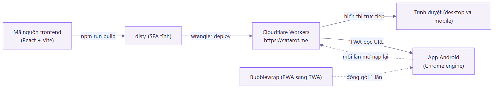
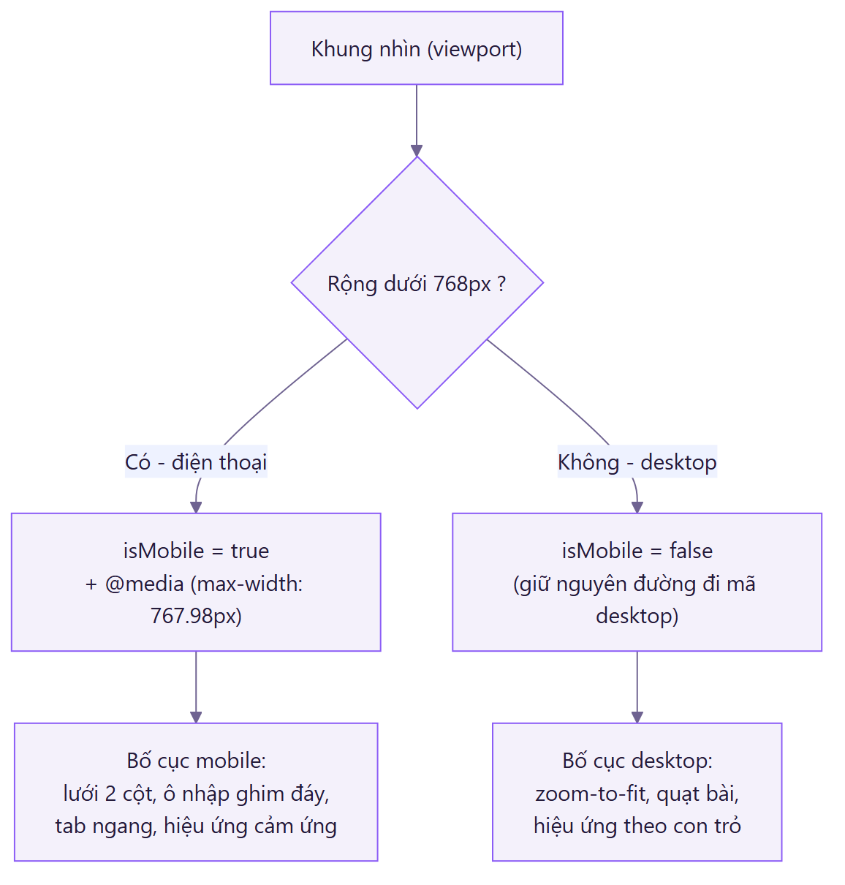
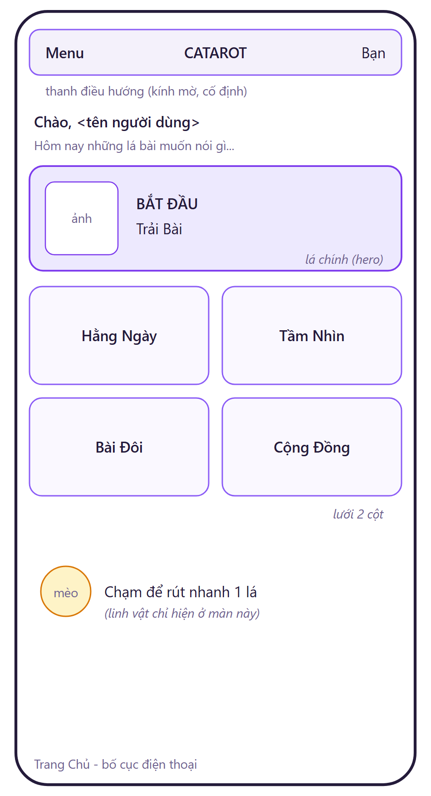
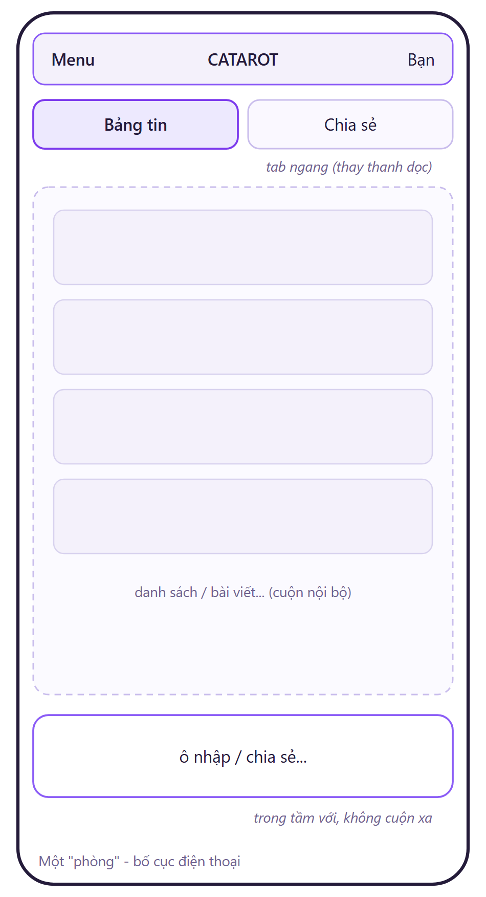
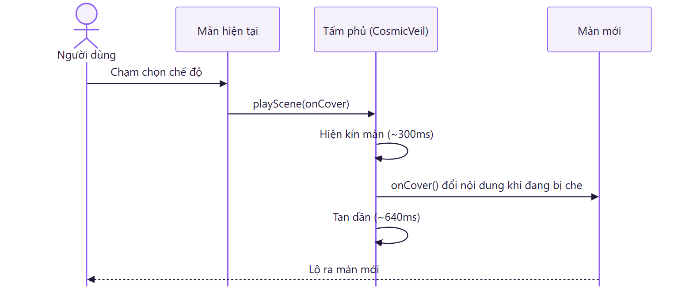
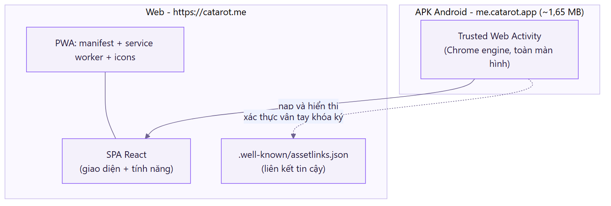

# Báo cáo bản mobile của CATAROT

Phần này trình bày cách đưa CATAROT lên điện thoại: làm cho giao diện thích ứng với màn hình nhỏ, thay các thao tác vốn dựa vào chuột bằng tương tác cảm ứng, và đóng gói website thành một ứng dụng Android cài đặt được.

## Mục lục

1. [Tổng quan & mục tiêu](#1-tổng-quan--mục-tiêu)
2. [Chiến lược: web responsive + đóng gói TWA](#2-chiến-lược-web-responsive--đóng-gói-twa)
3. [Cơ chế responsive trong mã nguồn](#3-cơ-chế-responsive-trong-mã-nguồn)
4. [Thiết kế giao diện theo từng màn](#4-thiết-kế-giao-diện-theo-từng-màn)
5. [Tương tác & hiệu ứng hợp cảm ứng](#5-tương-tác--hiệu-ứng-hợp-cảm-ứng)
6. [Trợ năng & hiệu năng trên thiết bị di động](#6-trợ-năng--hiệu-năng-trên-thiết-bị-di-động)
7. [Đóng gói ứng dụng Android (PWA sang TWA)](#7-đóng-gói-ứng-dụng-android-pwa-sang-twa)
8. [Hạn chế & hướng phát triển](#8-hạn-chế--hướng-phát-triển)

---

## 1. Tổng quan & mục tiêu

Bản mobile của CATAROT không phải một sản phẩm tách riêng. Nó vẫn là website `https://catarot.me`, nhưng được tối ưu để hiển thị và thao tác tốt trên điện thoại, đồng thời được đóng gói lại thành một app Android.

Khi làm phần này, nhóm đặt ra mấy mục tiêu:

- Dùng chung một bộ mã cho cả máy tính lẫn điện thoại, để khỏi phải nuôi hai dự án song song, và mọi cập nhật web đều có hiệu lực ở cả hai nơi.
- Giao diện chạm phải thoải mái trên màn hẹp: bố cục rõ ràng, ô nhập luôn trong tầm tay, không tràn ngang.
- Trên máy tính có vài hiệu ứng đi theo con trỏ chuột; lên điện thoại không còn con trỏ nên phải thay bằng hiệu ứng hợp với cảm ứng.
- Đóng gói được thành app Android để cài như một ứng dụng bình thường, nhưng vẫn giữ chi phí ở mức tối thiểu cho một đồ án sinh viên.

Nhóm giữ một nguyên tắc đơn giản: mọi thay đổi cho điện thoại đều khoanh vùng riêng (theo cờ `isMobile` hoặc `@media`), để giao diện máy tính vốn đã chạy ổn không bị ảnh hưởng.

---

## 2. Chiến lược: web responsive + đóng gói TWA

Để đưa một website lên điện thoại dưới dạng app, có ba hướng phổ biến:

| Hướng | Cách làm | Đánh giá cho dự án |
|-------|----------|--------------------|
| WebView thuần | Tự dựng app Android nhúng một `WebView` | Nhẹ nhưng engine bị cắt giảm, hay lỗi vặt, thiếu tính năng |
| React Native hoặc Flutter cộng WebView | Khung native bao ngoài một WebView | Nặng vài chục MB, vẫn mang nhược điểm WebView, chỉ đáng làm khi cần màn hình native thật |
| TWA (Trusted Web Activity) | App mở Chrome thật của máy, bọc website qua một liên kết tin cậy | Nhẹ nhất, hiển thị đúng như trên Chrome, tự cập nhật theo web |

Nhóm chọn hướng TWA. CATAROT vốn đã là một website hoàn chỉnh, không có màn hình native riêng nào, nên không cần tới React Native hay Flutter. TWA cho ra file cài đặt rất nhẹ (khoảng 1,65 MB), lại hiển thị bằng chính Chrome trên máy nên tránh được những lỗi vặt thường gặp ở WebView. Và vì app chỉ trỏ về website, mỗi lần triển khai bản web mới thì app tự cập nhật theo mà không phải đóng gói lại.

Tóm lại, cập nhật giao diện trên điện thoại chỉ là triển khai lại bản web.

---

## 3. Cơ chế responsive trong mã nguồn

Việc phân biệt máy tính với điện thoại dựa trên hai cơ chế chạy song song, cùng lấy mốc 768px:

- Hook `useIsMobile` theo dõi chiều rộng màn hình rồi trả về cờ `isMobile`, dùng để đổi bố cục và markup ngay trong React.
- Các khối CSS `@media` (`max-width: 768px`, `640px`, `767.98px`) lo phần kiểu hiển thị mà không cần đụng tới JavaScript.

Phần máy tính giữ nguyên đường đi cũ của mã, còn phần điện thoại được thêm trong nhánh `isMobile` hoặc khối `@media` riêng, nên hai bên không ảnh hưởng nhau. Riêng trang chính: bản máy tính thu phóng toàn trang cho vừa khung (`pageScale`), còn trên điện thoại thì tắt thu phóng và để nội dung chảy dọc, cuộn tự nhiên.

---

## 4. Thiết kế giao diện theo từng màn

Bảng dưới tóm tắt vấn đề trên màn hẹp và cách xử lý:

| Màn hình | Vấn đề trên màn hẹp | Cách xử lý cho mobile |
|----------|---------------------|------------------------|
| Trang Chủ | Năm lá xếp một cột, cuộn dài, thiếu thứ bậc | Lưới 2 cột, thêm một lá chính "Trải Bài" nổi bật, kèm lời chào và mô tả ngắn từng chế độ |
| Trải Bài (chat) | Ô nhập câu hỏi bị khuất dưới fold | Ghim ô nhập cố định ở đáy màn (`position: fixed`) để luôn nhìn thấy |
| Lưới rút bài | Lưới cao hơn màn, nút xác nhận trôi mất | Cho cuộn dọc; nút "Xác nhận" dính đáy (`sticky`) |
| Các phòng (Cộng Đồng, Kho Tầm Nhìn, Trải Bài Đôi) | Thanh điều hướng dọc chiếm chỗ, đẩy ô nhập xuống dưới; panel hẹp lệch trái | Đổi thanh điều hướng thành tab ngang gọn; panel vừa khít khung nhìn và cuộn bên trong; lấp đầy chiều ngang |
| Thanh điều hướng | Một số lối vào chỉ có trên máy tính | Đưa Cài đặt và Hướng dẫn vào menu (nút ba gạch) để dùng được trên điện thoại |
| Landing và Đăng nhập | Khoảng trống lớn, thiếu lời kêu gọi | Thêm nút vào trang giới thiệu; form đăng nhập dạng thẻ kính, căn giữa |

Các phòng (đọc bài đôi, cộng đồng, kho tầm nhìn) có điểm chung: trên máy tính chúng là một hộp căn giữa kèm thanh bên rộng 270px. Lên điện thoại, thanh bên đó được gập lại thành một dải tab nằm ngang ở trên cùng để nhường chỗ cho nội dung và ô nhập; chiều cao panel cũng bị giới hạn theo màn hình để nó cuộn bên trong, thay vì đẩy phần dưới ra khỏi tầm nhìn.

Hai phác thảo dưới đây minh họa bố cục Trang Chủ và một "phòng" trên điện thoại.

*Hình 1. Trang Chủ trên điện thoại: một lá chính nổi bật phía trên, bốn chế độ còn lại xếp lưới 2 cột.*

*Hình 2. Một "phòng" trên điện thoại: thanh dọc gập thành tab ngang, ô nhập nằm trong tầm với.*

---

## 5. Tương tác & hiệu ứng hợp cảm ứng

Trên máy tính có một số hiệu ứng dựa vào con trỏ chuột, chẳng hạn vệt sáng đi theo con trỏ hay lá bài nhô lên khi rê chuột. Những thứ này vô nghĩa trên màn cảm ứng vì không có con trỏ, lại còn tốn tài nguyên, nên bản điện thoại thay bằng:

- Nền cực quang động: vài vầng sáng tím và hồng trôi chậm phía sau nội dung, tạo cảm giác sống động mà không cần con trỏ.
- Hiệu ứng chuyển cảnh khi đổi giữa các mục: một lớp phủ quét qua che đúng lúc nội dung được thay, nên người dùng không thấy cảnh nhảy đột ngột.
- Rung nhẹ khi chọn lá, xác nhận rút bài hay mở menu (dùng `navigator.vibrate`; máy không hỗ trợ thì bỏ qua).
- Linh vật mèo: chạm vào là rút nhanh một lá ngẫu nhiên. Mèo chỉ xuất hiện ở màn chính và tự ẩn khi mở màn đọc bài để khỏi che ô nhập.
- Thẻ bài hiện ra lần lượt khi vào trang, gợi cảm giác đang bày bộ bài.

Vòng đời một lần chuyển cảnh trên điện thoại diễn ra như sau:

Toàn bộ hiệu ứng chỉ dùng các thuộc tính nhẹ (transform và opacity) để giữ độ mượt trên điện thoại.

---

## 6. Trợ năng & hiệu năng trên thiết bị di động

- Nếu người dùng bật "Giảm chuyển động" trong hệ điều hành, hook `useReducedMotion` sẽ nhận biết và tắt bớt hiệu ứng nền lẫn chuyển cảnh.
- Hook `useInView` (dựa trên `IntersectionObserver`) chỉ chạy hiệu ứng khi phần tử lọt vào khung nhìn, tránh chạy thừa.
- Các hoạt ảnh đều ưu tiên `transform` và `opacity` thay vì những thuộc tính làm dồn lại bố cục, nên khung hình ổn định hơn và đỡ tốn pin.
- Các màn được kiểm tra để không bị tràn ngang, không xuất hiện thanh cuộn ngang ngoài ý muốn.

---

## 7. Đóng gói ứng dụng Android (PWA sang TWA)

Quá trình gồm hai lớp.

Trước hết, website được chuẩn bị thành một Progressive Web App: khai báo `manifest.webmanifest` (tên, icon, màu chủ đề, chế độ toàn màn hình), một service worker (`sw.js`) để cache tài nguyên cùng nguồn cho mở nhanh, và bộ icon trong `frontend/public`. Đây là điều kiện cần để một trang web đủ tư cách trở thành app.

Sau đó dùng Bubblewrap để sinh một dự án Android bọc địa chỉ `https://catarot.me` thành Trusted Web Activity:

- Định danh gói là `me.catarot.app`.
- Tệp `/.well-known/assetlinks.json` đặt ngay trên domain, chứa vân tay khóa ký của app. Nhờ liên kết tin cậy này, app mở web ở chế độ toàn màn hình và bỏ luôn thanh địa chỉ, nhìn như một ứng dụng thật.
- File cài đặt là một APK đã ký, khoảng 1,65 MB, `minSdk 21`, chạy bằng Chrome trên máy. File này được kèm sẵn trong repo tại `mobile/catarot.apk` (xem `mobile/README.md`).

Vì app chỉ là lớp vỏ trỏ tới website, muốn cập nhật giao diện hay tính năng thì chỉ cần triển khai lại bản web rồi mở app lên là thấy bản mới, không phải cài lại APK.

---

## 8. Hạn chế & hướng phát triển

- App cần một trình duyệt hỗ trợ (Chrome hoặc tương đương) có sẵn trên máy; trường hợp hiếm không có thì rơi về mở bằng trình duyệt thường.
- Hiện chưa khai thác các tính năng thuần native như thông báo đẩy hay hoạt động ngoại tuyến sâu. Nếu sau này cần, có thể chuyển sang một development client, hoặc nhúng web vào khung native ở những màn thật sự cần.
- Sau khi triển khai bản mới, lần mở đầu tiên đôi khi còn hiện bản cũ trong chốc lát cho tới khi service worker tải lại tài nguyên.
- Một số hướng làm tiếp: thêm thông báo đẩy cho lá bài hằng ngày, nén bớt ảnh tài nguyên, và kiểm thử giao diện trên nhiều kích thước màn hình hơn.
