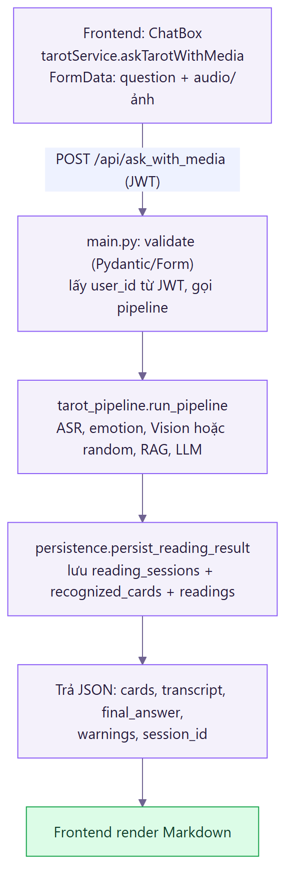

# Bố cục mã nguồn CATAROT

Đây là bản đồ code để đọc nhanh: thư mục nào làm gì, file nào lo việc gì, và một request đọc bài đi qua những bước nào. Dùng khi cần review hoặc chấm code mà không muốn lội từ đầu.

## Tổng quan repo (monorepo)

```
llm-tarot-reader/
  backend/        # API + AI (FastAPI, Python) - phần xử lý
  frontend/       # Giao diện (React + Vite) - phần hiển thị
  mobile/         # Gói APK Android (TWA bọc web) - xem docs/BAO-CAO-MOBILE.md
  alembic/        # Migration cơ sở dữ liệu (5 revision)
  docs/           # Báo cáo, sơ đồ, hướng dẫn, bố cục (file này)
  docker-compose.yml   # Chạy full-stack bằng một lệnh
```

Backend chia làm ba tầng. `main.py` lo phần HTTP và định tuyến. Nó gọi xuống `advanced` và `pipeline` để xử lý nghiệp vụ, còn `db` ở dưới cùng lo dữ liệu.

---

## BACKEND (`backend/src/`)

### Tầng HTTP (điểm vào)
| File | Vai trò |
|------|---------|
| `main.py` | Điểm vào FastAPI: đăng ký 63 route REST và 1 WebSocket, middleware (request-id, CORS, exception handler tổng), lifespan (khởi tạo DB và bật scheduler), Pydantic validate request. Route mỏng, gọi xuống tầng service. |

### `pipeline/`: trái tim đa phương thức
| File | Vai trò |
|------|---------|
| `tarot_pipeline.py` | Bộ điều phối đọc bài: ASR, cảm xúc, Vision hoặc rút ngẫu nhiên, RAG, rồi LLM. Gom cảnh báo thay vì ném lỗi. |

### Các adapter AI
| File | Vai trò |
|------|---------|
| `asr/transcribe.py` | ASR: chuyển giọng nói thành chữ (faster-whisper, fallback transformers; song ngữ Việt và Anh). |
| `vision/embedder.py` | Sinh embedding ảnh bằng OpenCLIP (có demo mode khi thiếu model). |
| `vision/index.py` | Tìm lá gần nhất bằng FAISS (cosine similarity). |
| `vision/predict_card.py` | Nhận diện lá bài từ ảnh: embed ảnh gốc cộng ảnh xoay 180 độ (để nhận lá ngược), tính độ tin cậy. |
| `vision/preprocess.py` | Tiền xử lý ảnh (load, xoay). |
| `rag/retrieve.py` | RAG: tra ý nghĩa lá bài liên quan (sentence-transformers cộng FAISS), lọc theo lá và chiều. |
| `rag/build_index.py` | Dựng index RAG cộng lớp embedder text (có demo fallback). |
| `llm/generate.py` | Sinh luận giải: chuỗi dự phòng Gemini, OpenAI, Groq, Ollama, rồi template tất định; che API key trong log. |
| `llm/card_meanings_vi.py` | Từ điển nghĩa lá bài tiếng Việt (cho fallback tất định). |
| `tts/synthesize.py` | TTS: đọc luận giải thành giọng nói tiếng Việt (`facebook/mms-tts-vie`, VITS qua transformers); xuất WAV bằng thư viện chuẩn `wave`, lỗi thì suy biến mềm (trả cảnh báo thay vì sập). |
| `advanced/emotion_analysis.py` | Phân tích cảm xúc giọng nói bằng tín hiệu số (không dùng model ML). |

### `auth/`: xác thực và phân quyền
| File | Vai trò |
|------|---------|
| `auth/security.py` | Băm mật khẩu PBKDF2 200 nghìn vòng, ký và giải JWT HS256. |
| `auth/service.py` | Đăng ký, đăng nhập, đặt lại mật khẩu, Google OAuth, chống dò email. |
| `auth/deps.py` | Dependency lấy user hiện tại từ JWT; guard chống IDOR (`_ensure_self_or_admin`). |

### `db/`: tầng dữ liệu (SQLAlchemy 2.0)
| File | Vai trò |
|------|---------|
| `db/models.py` | 24 bảng ORM cộng ràng buộc (CheckConstraint, UniqueConstraint, FK với CASCADE và SET NULL). |
| `db/session.py` | Engine kép (SQLite và Postgres), `session_scope()` tự commit, rollback, close. |
| `db/persistence.py` | Lưu kết quả một phiên đọc (session, cards, reading) trong một transaction, nuốt lỗi mềm. |
| `db/init_db.py` | Khởi tạo DB lúc startup (create_all cộng lightweight migration ALTER ADD COLUMN, áp unique và index còn thiếu). |
| `db/seed.py` | Seed 78 lá bài tham chiếu (idempotent). |

### `advanced/`: các tính năng nghiệp vụ
| File | Vai trò |
|------|---------|
| `daily_card.py` | Lá bài một lần mỗi ngày cộng streak (chống trùng bằng unique constraint). |
| `daily_deep_reading.py` | Luận giải sâu theo chủ đề tự do (RAG cộng LLM), cache theo bộ ba (user, ngày, chủ đề). |
| `affirmations.py` | Câu khẳng định tất định (hash SHA-1, không tốn LLM). |
| `dream_journal.py` | Nhật ký giấc mơ: trích biểu tượng, ánh xạ lá bài, diễn giải tổng hợp cộng liên hệ phiên đọc và câu hỏi phản tư. |
| `conversation.py` | Hội thoại tiếp nối (giữ 8 lượt gần nhất, tóm tắt lượt cũ). |
| `community_room.py` | Phòng cộng đồng: đăng ẩn danh, vote, kiểm duyệt (tránh truy vấn N cộng 1, chống đua vote). |
| `community_automod.py` | Bot kiểm duyệt hai lớp (luật cộng Gemini), chống prompt injection, nghi ngờ thì escalate. |
| `duo_reading.py` | Đọc bài đôi realtime (WebSocket cộng invite code). |
| `time_capsule.py` | Viên nang thời gian (niêm phong dự đoán, mở khi tới hạn). |
| `archetype_profiler.py` | Hồ sơ nguyên mẫu (Soul Card) từ lịch sử, không dùng LLM. |
| `oracle_reports.py` | Báo cáo Oracle hằng tháng (LLM cộng fallback, gửi email). |
| `rating_reminders.py` | Nhắc chấm điểm buổi đọc qua email cộng scheduler. |
| `notifications.py` | Thông báo in-app và email cộng job đẩy lá bài hằng ngày. |
| `analytics.py` | Ghi sự kiện cộng funnel và retention D1, D7. |
| `analytics_scheduler.py` | Gom job định kỳ (archetype tuần, oracle tháng, mở capsule). |
| `question_suggestions.py` | Gợi ý câu hỏi theo pha trăng và thứ trong tuần (rule-based). |
| `spread_recommender.py` | Gợi ý kiểu trải bài (rule-based). |
| `share_image.py` | Sinh ảnh PNG chia sẻ lá bài hằng ngày. |

### `utils/`: tiện ích dùng chung
| File | Vai trò |
|------|---------|
| `config.py` | Đọc cấu hình và resolve đường dẫn. |
| `logging.py` | Logger chuẩn hóa. |
| `rate_limit.py` | Giới hạn tần suất (sliding window in-memory). |
| `validators.py` | Validate email. |
| `timezone.py` | Múi giờ ứng dụng (mặc định Asia/Ho_Chi_Minh). |
| `io.py` | Hàm I/O phụ trợ. |

---

## FRONTEND (`frontend/src/`)

| Thư mục hoặc file | Vai trò |
|----------------|---------|
| `main.jsx` và `App.jsx` | Entry cộng routing (React Router v7, lazy-load), route guard `RequireAuth`. |
| `pages/` | 6 trang: `LandingPage`, `LoginPage`, `SigninPage`, `ForgotPasswordPage`, `ResetPasswordPage`, và `HomePage` (màn chính, gộp mọi tính năng). |
| `services/` | Gọi API theo domain: `api.js` (axios cộng interceptor JWT), `authService`, `tarotService`, `dailyService`, `communityService`, `duoService`, `historyService`, `visionsService`, `speechService` (TTS đọc kết quả), `sessionCache`. |
| `context/` | `AppSettingsContext`: cài đặt toàn cục (âm thanh mèo, hiệu ứng con trỏ, đọc kết quả TTS, âm lượng nhạc) cộng chuỗi văn bản tiếng Việt. |
| `features/login/` | Form đăng nhập, đăng ký, quên mật khẩu cộng `GoogleLoginButton`. |
| `components/ui/` | Component giao diện: `ChatBox`, `ChatConversation`, `TarotSpreadGrid`, `TarotResultPanel`, `DailyResultPanel`, `DeepReadingPanel`, `DreamJournalComposer`, `DreamEntryCard`, `VisionsVaultPanel`, `CommunityReadingPanel`, `DuoReadingPanel`. |
| `components/transition/`, `layout/`, `common/` | Hiệu ứng chuyển cảnh, navbar, con trỏ WebGL. |
| `hooks/` và `lib/` | `useIsMobile`, ảnh lá bài. |

---

## Luồng một request "đọc bài" (đầu tới cuối)



---

## "Thầy hỏi X thì mở file nào"

| Câu hỏi | File |
|---------|------|
| Nhận diện lá bài bằng gì? | `vision/predict_card.py`, `vision/embedder.py`, `vision/index.py` |
| LLM sinh luận giải và fallback? | `llm/generate.py` |
| RAG hoạt động ra sao? | `rag/retrieve.py` |
| Giọng nói thành chữ? | `asr/transcribe.py` |
| Chữ thành giọng nói (đọc luận giải)? | `tts/synthesize.py` cộng route `/api/tts` trong `main.py` |
| Bot kiểm duyệt cộng đồng? | `advanced/community_automod.py` |
| Diễn giải giấc mơ? | `advanced/dream_journal.py` |
| Bảo mật mật khẩu và JWT? | `auth/security.py`, `auth/service.py`, `auth/deps.py` |
| Cấu trúc DB và bảng? | `db/models.py` |
| Route và API? | `main.py` |
| Pipeline tổng thể? | `pipeline/tarot_pipeline.py` |
| Test? | `backend/tests/` (174 hàm test trên 26 file) |
