# Sơ đồ kiến trúc hệ thống CATAROT

Tài liệu này gom các sơ đồ mô tả cách CATAROT được dựng nên: kiến trúc tổng thể, pipeline AI, đường đi của dữ liệu trong một lượt đọc bài, và cách triển khai lên ba hạ tầng. Trước mỗi hình có một đoạn ngắn nói ý chính để người đọc nắm được bức tranh rồi mới nhìn vào sơ đồ.

---

## 1. Kiến trúc tổng thể (ba hạ tầng tách rời)

Hệ thống gồm ba phần chạy độc lập. Frontend là ứng dụng React 19 dựng bằng Vite 7, lo giao diện và điều hướng. Backend là một dịch vụ FastAPI gom toàn bộ logic nghiệp vụ về một chỗ, từ tầng HTTP xuống tầng dữ liệu. Cuối cùng là cơ sở dữ liệu PostgreSQL, dùng Neon khi chạy thật và SQLite khi phát triển. Ba phần được đặt ở ba nơi khác nhau, mỗi nơi hợp với một nhu cầu riêng.

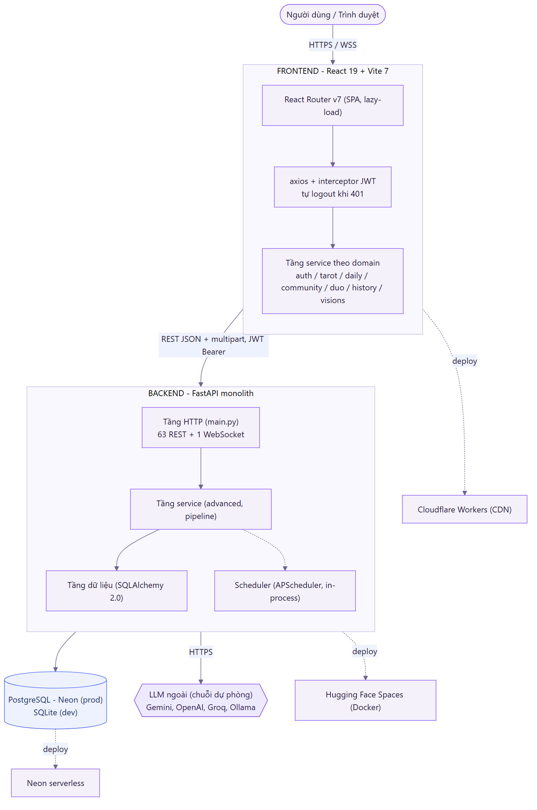

*Hình 1. Kiến trúc tổng thể và ba hạ tầng triển khai.*

---

## 2. Pipeline AI đa phương thức (bảy bước của `run_pipeline`)

Khi người dùng gửi một lượt đọc bài, hàm `run_pipeline` chạy tuần tự qua nhiều bước. Nếu có giọng nói, đoạn ghi âm được chuyển thành chữ và phân tích cảm xúc; ảnh lá bài thì đưa qua thị giác máy để nhận diện. Câu hỏi dạng chữ, phần chuyển từ giọng nói và các lá nhận ra được gộp thành một truy vấn chung. Truy vấn đó đi qua bước RAG để lấy về các đoạn nghĩa lá liên quan, rồi giao cho LLM viết phần luận giải cuối cùng bằng tiếng Việt.

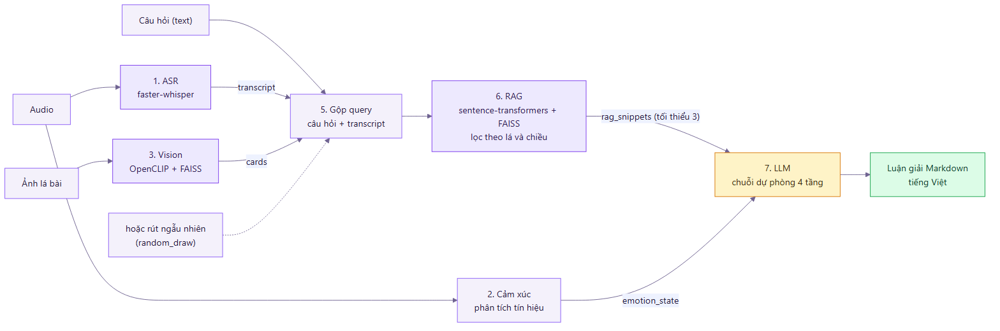

*Hình 2. Bảy bước xử lý đa phương thức trong `run_pipeline`.*

---

## 3. Điểm nhấn: chuỗi dự phòng LLM bốn tầng

Phần sinh luận giải dựa vào LLM bên ngoài, mà các dịch vụ này có thể hết quota hoặc lỗi mạng bất cứ lúc nào. Nhóm xử lý bằng một chuỗi dự phòng bốn tầng: thử Gemini trước, hỏng thì lần lượt chuyển xuống OpenAI, Groq rồi Ollama chạy cục bộ. Tầng nào trả về trước thì dùng tầng đó và ghi lại tên model. Trường hợp cả bốn cùng hỏng, hệ thống vẫn còn một lớp dự phòng tất định dựng từ template và từ điển nghĩa lá; lớp này chạy được mà không cần internet, nên người dùng không bao giờ rơi vào màn hình trắng.

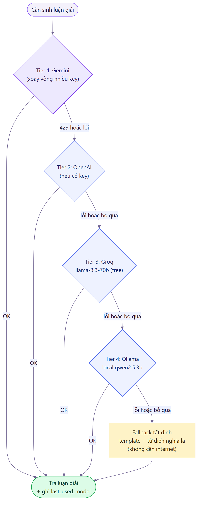

*Hình 3. Chuỗi dự phòng bốn tầng, kết thúc bằng lớp fallback tất định chạy offline.*

---

## 4. Luồng một lượt đọc bài

Sơ đồ dưới đây theo chân một lượt đọc bài từ lúc người dùng gửi câu hỏi cho tới khi nhận lại kết quả. Sau khi qua rate limit và bước kiểm tra dữ liệu bằng Pydantic, backend lấy `user_id` từ JWT chứ không tin phần thân request, rồi gọi pipeline xử lý đa phương thức và LLM. Có một điểm đáng chú ý: bước lưu kết quả vào cơ sở dữ liệu nuốt lỗi mềm. Nếu ghi thất bại, người dùng vẫn nhận được luận giải, chỉ là lượt đọc đó không được lưu lại.

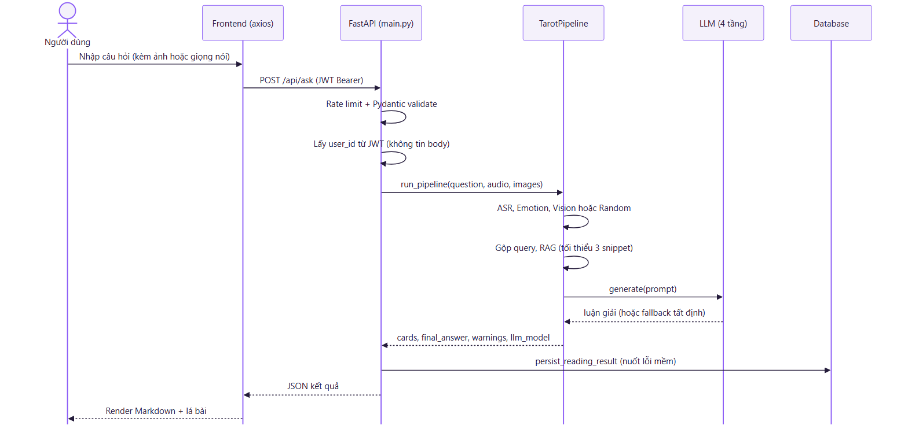

*Hình 4. Trình tự một lượt đọc bài, từ câu hỏi tới luận giải.*

---

## 5. Vision: nhận diện lá bài và lá ngược

Để nhận ra một lá bài và biết nó đang xuôi hay ngược, hệ thống embed ảnh gốc bằng OpenCLIP, rồi xoay ảnh 180 độ và embed thêm lần nữa. Cả hai bản đều được dò trong FAISS bằng cosine similarity; ứng viên đến từ ảnh xoay nếu khớp thì được đảo lại chiều cho đúng. Sau khi gộp ứng viên và chọn điểm cao nhất, độ tin cậy được tính từ khoảng cách giữa hai kết quả dẫn đầu. Nếu độ tin cậy chưa đạt ngưỡng, hệ thống không đoán bừa mà báo người dùng chụp lại hoặc tự chọn trong top 5.

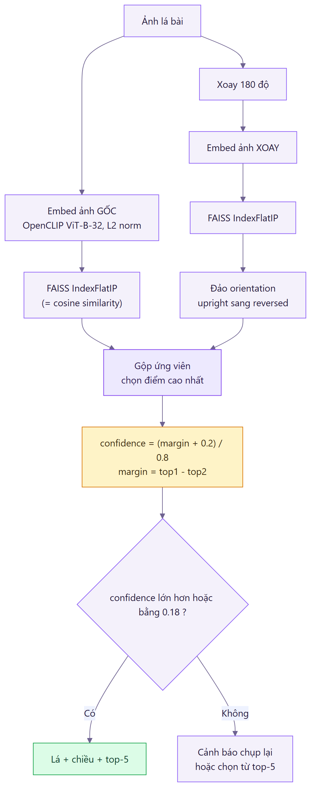

*Hình 5. Cách nhận diện lá bài và phân biệt chiều xuôi/ngược.*

---

## 6. ERD cụm lõi đọc bài (bảy bảng chính)

Đây là cụm bảng trung tâm của tính năng đọc bài. Mỗi lần đọc tạo ra một `reading_sessions`, từ đó kéo theo các lá nhận diện được, phần luận giải (quan hệ một-một), các lượt hội thoại và nhắc đánh giá. Tài khoản người dùng liên kết với phiên đọc theo kiểu SET NULL, nên khi xóa tài khoản thì các phiên cũ vẫn còn lại dưới dạng ẩn danh thay vì biến mất.

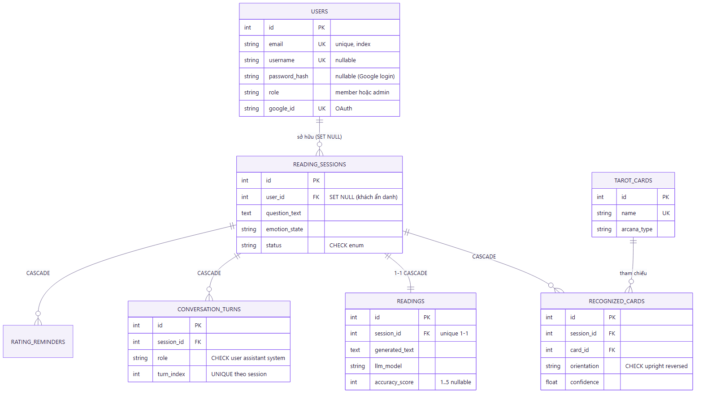

*Hình 6. Quan hệ giữa các bảng trong cụm lõi đọc bài.*

---

## 7. Bản đồ 24 bảng theo cụm chức năng

Toàn bộ lược đồ có 24 bảng. Để dễ hình dung, nên nhóm chúng theo chức năng. Cụm lõi đọc bài là phần đã mô tả ở trên. Quanh nó là các cụm phụ trợ cho phân tích, đọc bài đôi, cộng đồng, và một nhóm tính năng khác như nhật ký giấc mơ hay lá bài hằng ngày. Bảng `users` đóng vai trục chung, liên kết tới hầu hết các cụm.

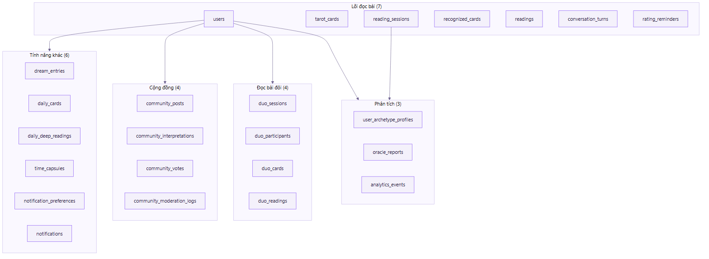

*Hình 7. Năm cụm chức năng của lược đồ 24 bảng.*

---

## 8. Đọc bài đôi: máy trạng thái

Một phiên đọc bài đôi đi qua vài trạng thái rõ ràng. Chủ phòng tạo phòng và giữ slot A, hệ thống chờ người thứ hai vào slot B, rồi chờ cả hai rút đủ lá. Khi đã đủ hai lá, phiên chuyển sang gọi LLM, và lệnh gọi này được đặt ngoài transaction để cuộc gọi mạng kéo dài không giữ khóa cơ sở dữ liệu. Nếu sinh luận giải lỗi thì vẫn có fallback tất định, nhờ vậy phiên không kẹt giữa chừng.

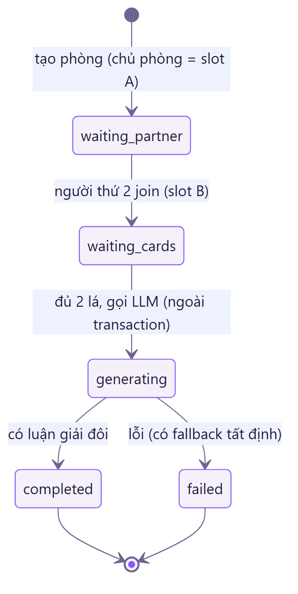

*Hình 8. Các trạng thái của một phiên đọc bài đôi.*

---

## 9. Cộng đồng và bot kiểm duyệt

Bài đăng cộng đồng ở chế độ ẩn danh và khởi đầu với trạng thái pending. Việc duyệt có thể do người thật làm, hoặc giao cho bot tự động. Bot này mặc định tắt và phải bật thủ công. Khi bật, nó chạy hai lớp. Lớp đầu áp các luật cứng như độ dài, từ cấm, thông tin cá nhân và spam. Lớp sau nhờ Gemini phân loại sâu hơn, có chống prompt injection. Chỉ những bài lớp hai khẳng định an toàn mới được duyệt; phần còn nghi ngờ, hoặc khi LLM lỗi, thì đẩy về cho người duyệt thay vì để bot tự quyết.

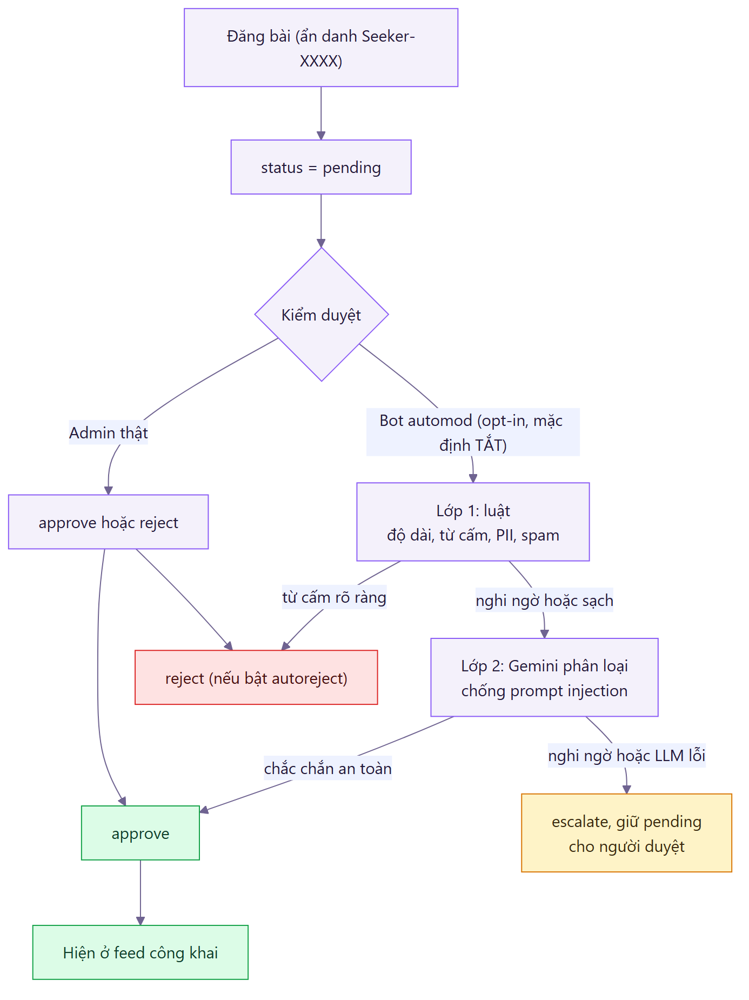

*Hình 9. Luồng kiểm duyệt: admin thật và bot hai lớp với cơ chế escalate.*

---

## 10. Triển khai: ba nơi cho ba nhu cầu

Sở dĩ ba phần được đặt ở ba nơi khác nhau là vì mỗi phần có nhu cầu riêng. Backend mang theo model AI nên cần nhiều RAM, hợp với Hugging Face Spaces chạy Docker. Frontend chỉ là tài nguyên tĩnh, cần phân phối nhanh nên đặt trên Cloudflare Workers. Còn cơ sở dữ liệu cần độ bền và sẵn sàng cao nên dùng PostgreSQL serverless của Neon. Trình duyệt nói chuyện với frontend, frontend gọi backend kèm JWT, và backend kết nối tới Neon qua kênh bắt buộc mã hóa.

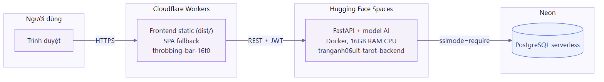

*Hình 10. Ba hạ tầng triển khai và đường kết nối giữa chúng.*

---

## 11. Xác thực: đăng nhập thường và Google OAuth

Hệ thống hỗ trợ hai cách đăng nhập. Với cách thường, mật khẩu được kiểm bằng PBKDF2 200 nghìn vòng và so sánh theo `compare_digest` để tránh rò rỉ thời gian; đăng nhập thành công thì trả về JWT HS256 hạn 120 phút. Với Google, frontend nhận `id_token` từ Google rồi gửi lên backend; backend xác minh token với đúng audience là `GOOGLE_CLIENT_ID`, sau đó liên kết `google_id` vào tài khoản cũ hoặc tạo tài khoản mới với vai trò member trước khi cấp JWT.

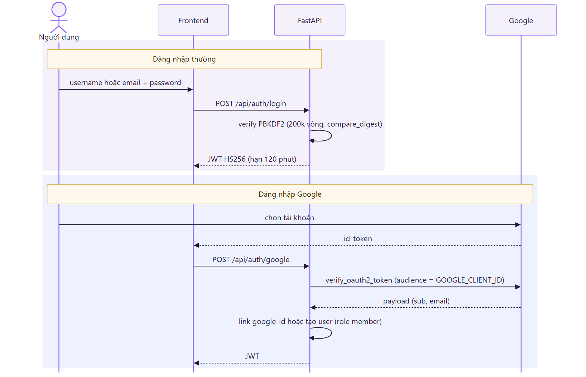

*Hình 11. Hai luồng xác thực: đăng nhập thường và đăng nhập Google.*
