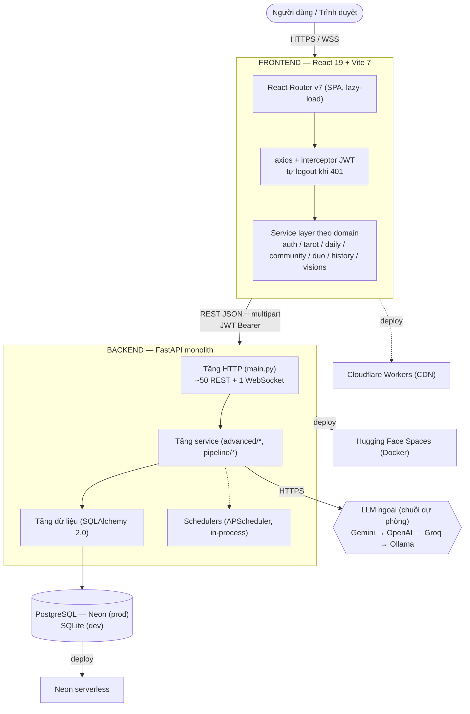
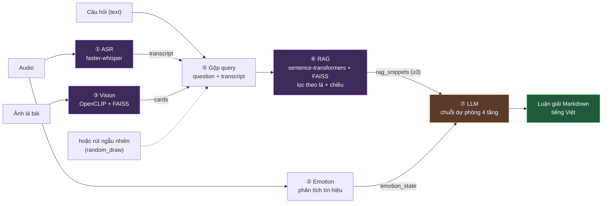
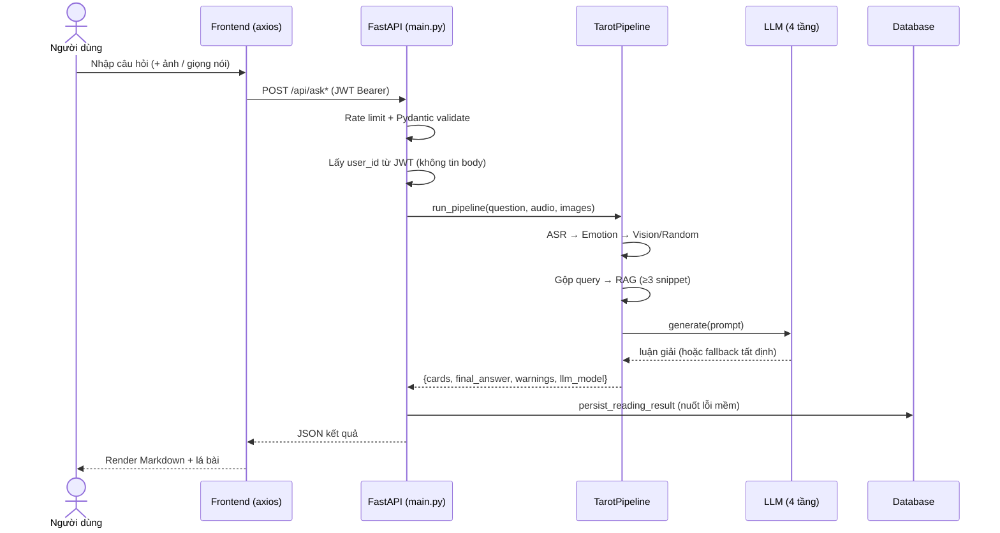
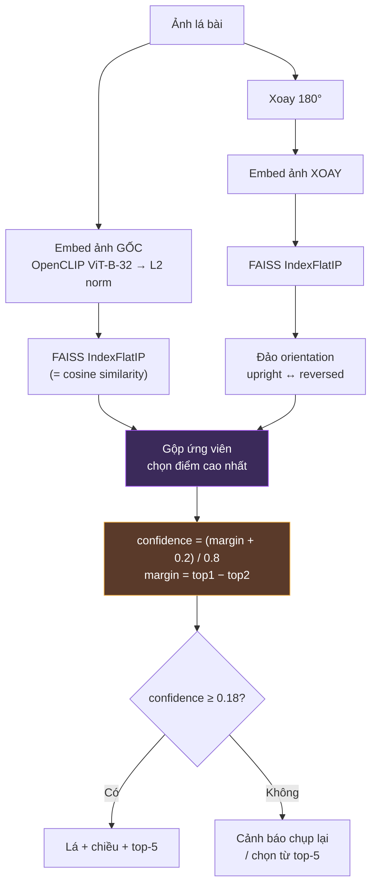
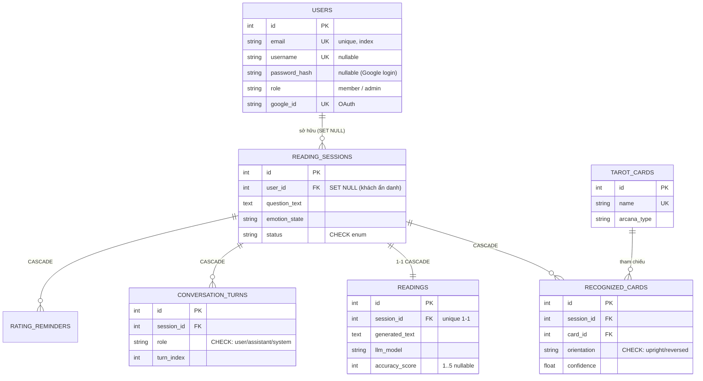
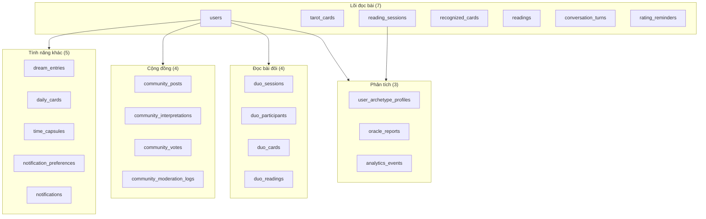
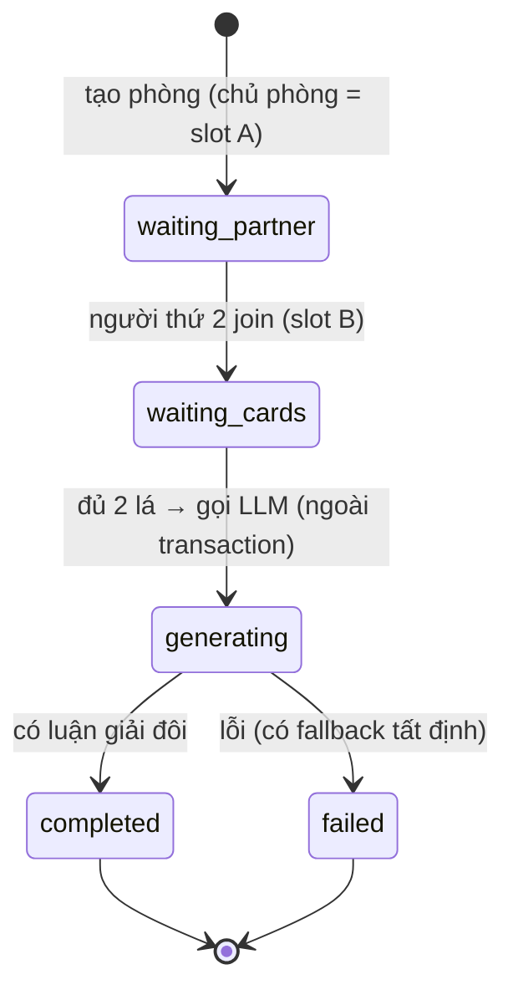
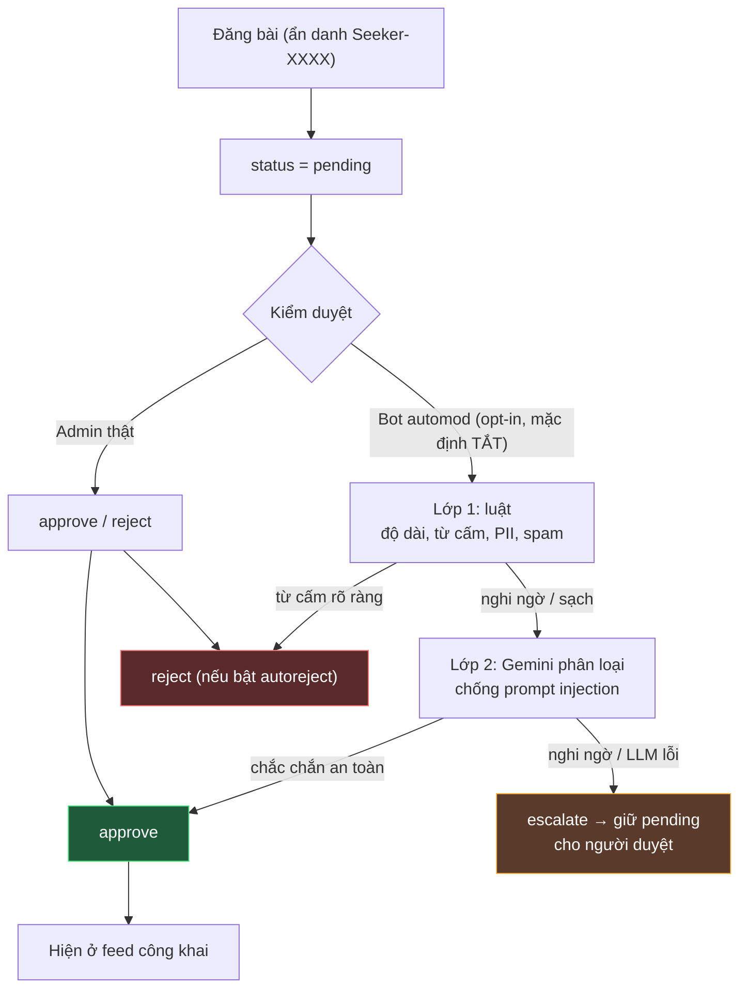

# [CATAROT] SƠ ĐỒ KIẾN TRÚC

Phần này tập hợp các sơ đồ mô tả cách CATAROT được dựng nên: kiến trúc tổng thể, pipeline AI, cách dữ liệu chảy qua hệ thống khi đọc bài, và cách triển khai lên ba hạ tầng khác nhau. Mỗi sơ đồ đi kèm một đoạn diễn giải ngắn để người đọc nắm được ý chính trước khi nhìn vào hình.

---

## 1. Kiến trúc tổng thể (3 hạ tầng tách rời)

Hệ thống chia làm ba phần chạy độc lập. Frontend là một ứng dụng React 19 dựng bằng Vite 7, lo phần giao diện và điều hướng. Backend là một dịch vụ FastAPI gom mọi logic nghiệp vụ vào một chỗ, từ tầng HTTP xuống tầng dữ liệu. Sau cùng là cơ sở dữ liệu PostgreSQL, dùng Neon khi chạy thật và SQLite khi phát triển. Ba phần này được deploy ở ba nơi khác nhau, mỗi nơi hợp với một nhu cầu riêng.

---

## 2. Pipeline AI đa phương thức (7 bước của `run_pipeline`)

Khi người dùng gửi một lượt đọc bài, hàm `run_pipeline` xử lý tuần tự qua nhiều bước. Giọng nói nếu có sẽ được chuyển thành chữ và phân tích cảm xúc; ảnh lá bài được nhận diện bằng thị giác máy. Câu hỏi dạng chữ, phần chuyển từ giọng nói và các lá bài nhận ra được gộp lại thành một truy vấn chung. Truy vấn đó đi qua bước RAG để lấy về các đoạn nghĩa lá liên quan, rồi đưa cho LLM sinh phần luận giải cuối cùng bằng tiếng Việt.

---

## 3. Điểm nhấn — Chuỗi dự phòng LLM 4 tầng (graceful degradation)

Việc sinh luận giải phụ thuộc vào LLM bên ngoài, mà các dịch vụ này có thể hết quota hoặc lỗi mạng bất cứ lúc nào. Nhóm xử lý bằng một chuỗi dự phòng bốn tầng: thử Gemini trước, nếu hỏng thì chuyển dần xuống OpenAI, Groq rồi Ollama chạy cục bộ. Tầng nào trả về trước thì dùng tầng đó và ghi lại model đã dùng. Nếu cả bốn cùng hỏng, hệ thống vẫn còn một lớp fallback tất định dựng từ template và từ điển nghĩa lá, chạy được mà không cần internet, nên người dùng không bị kẹt ở màn hình trắng.

---

## 4. Luồng đọc bài (Sequence Diagram)

Sơ đồ dưới đây theo chân một lượt đọc bài từ lúc người dùng gửi câu hỏi cho tới khi nhận lại kết quả. Sau khi đi qua rate limit và kiểm tra dữ liệu bằng Pydantic, backend lấy `user_id` từ JWT chứ không tin phần thân request, rồi gọi pipeline xử lý đa phương thức và LLM. Một điểm đáng chú ý là bước lưu kết quả vào cơ sở dữ liệu nuốt lỗi mềm: nếu ghi thất bại thì người dùng vẫn nhận được luận giải, chỉ là lần đọc đó không được lưu lại.

---

## 5. Vision — Nhận diện lá bài & lá ngược

Để nhận ra một lá bài và biết nó đang xuôi hay ngược, hệ thống embed ảnh gốc bằng OpenCLIP rồi đem xoay 180° và embed thêm lần nữa. Cả hai bản đều được dò trong FAISS bằng cosine similarity; ảnh xoay nếu khớp thì đảo lại chiều cho đúng. Sau khi gộp ứng viên và chọn điểm cao nhất, độ tin cậy được tính từ khoảng cách giữa hai kết quả dẫn đầu. Nếu độ tin cậy chưa đạt ngưỡng, hệ thống không đoán bừa mà báo người dùng chụp lại hoặc tự chọn trong top-5.

---

## 6. ERD — Cụm lõi đọc bài (7 bảng chính)

Đây là cụm bảng trung tâm của tính năng đọc bài. Mỗi lần đọc tạo ra một `READING_SESSIONS`, từ đó kéo theo các lá nhận diện được, phần luận giải (quan hệ 1-1), các lượt hội thoại và nhắc đánh giá. Tài khoản người dùng liên kết với phiên đọc theo kiểu SET NULL, nên khi xoá tài khoản thì các phiên cũ vẫn còn lại dưới dạng ẩn danh thay vì biến mất.

---

## 7. Bản đồ 24 bảng theo cụm chức năng

Toàn bộ lược đồ có 24 bảng, nhưng để dễ hình dung thì nên nhóm chúng theo chức năng. Cụm lõi đọc bài là phần đã mô tả ở trên. Quanh nó là các cụm phụ trợ cho phân tích, đọc bài đôi, cộng đồng và một nhóm tính năng khác như nhật ký giấc mơ hay lá bài hằng ngày. Bảng `users` đóng vai trò trục chung, liên kết tới hầu hết các cụm.

---

## 8. Đọc bài đôi — máy trạng thái (State Diagram)

Một phiên đọc bài đôi đi qua vài trạng thái rõ ràng. Chủ phòng tạo phòng và giữ slot A, hệ thống chờ người thứ hai vào slot B, rồi chờ cả hai rút đủ lá. Khi đã đủ hai lá, phiên chuyển sang gọi LLM, và việc gọi này được đặt ngoài transaction để cuộc gọi mạng kéo dài không giữ khoá cơ sở dữ liệu. Nếu sinh luận giải lỗi thì vẫn có fallback tất định để phiên không kẹt giữa chừng.

---

## 9. Cộng đồng + Auto-moderation (luồng kiểm duyệt)

Bài đăng cộng đồng ở chế độ ẩn danh và bắt đầu với trạng thái pending. Việc duyệt có thể do người thật làm, hoặc giao cho bot tự động. Bot này mặc định tắt và phải bật thủ công. Khi bật, nó chạy hai lớp: lớp đầu áp các luật cứng như độ dài, từ cấm, thông tin cá nhân và spam; lớp sau nhờ Gemini phân loại sâu hơn, có chống prompt injection. Chỉ những bài lớp hai khẳng định an toàn mới được duyệt; phần còn nghi ngờ hoặc khi LLM lỗi thì đẩy về cho người duyệt thay vì để bot tự quyết.

---

## 10. Triển khai (Deploy) — 3 nơi vì 3 nhu cầu

Sở dĩ ba phần được đặt ở ba nơi khác nhau là vì mỗi phần có nhu cầu riêng. Backend mang theo model AI nên cần nhiều RAM, hợp với Hugging Face Spaces chạy Docker. Frontend chỉ là tài nguyên tĩnh, cần phân phối nhanh nên đặt trên Cloudflare Workers. Còn cơ sở dữ liệu cần độ bền và sẵn sàng cao nên dùng PostgreSQL serverless của Neon. Trình duyệt nói chuyện với frontend, frontend gọi backend kèm JWT, và backend kết nối tới Neon qua kênh bắt buộc mã hoá.

---

## 11. Xác thực (Auth) — Login & Google OAuth

```mermaid
sequenceDiagram
    actor U as Người dùng
    participant FE as Frontend
    participant API as FastAPI
    participant G as Google

    rect rgb(40, 30, 60)
    note over U,API: Đăng nhập thường
    U->>FE: username/email + password
    FE->>API: POST /api/auth/login
    API->>API: verify PBKDF2 (200k vòng, compare_digest)
    API-->>FE: JWT HS256 (hạn 120 phút)
    end

    rect rgb(30, 40, 60)
    note over U,G: Đăng nhập Google
    U->>G: chọn tài khoản
    G-->>FE: id_token
    FE->>API: POST /api/auth/google
    API->>G: verify_oauth2_token(audience = GOOGLE_CLIENT_ID)
    G-->>API: payload (sub, email)
    API->>API: link google_id / tạo user (role member)
    API-->>FE: JWT
    end
```

Hệ thống hỗ trợ hai cách đăng nhập. Với cách thường, mật khẩu được kiểm bằng PBKDF2 200k vòng và so sánh theo `compare_digest` để tránh rò rỉ thời gian, đăng nhập thành công thì trả về JWT HS256 hạn 120 phút. Với Google, frontend nhận `id_token` từ Google rồi gửi lên backend; backend xác minh token với đúng audience là `GOOGLE_CLIENT_ID`, sau đó liên kết `google_id` vào tài khoản cũ hoặc tạo tài khoản mới với vai trò member trước khi cấp JWT.

