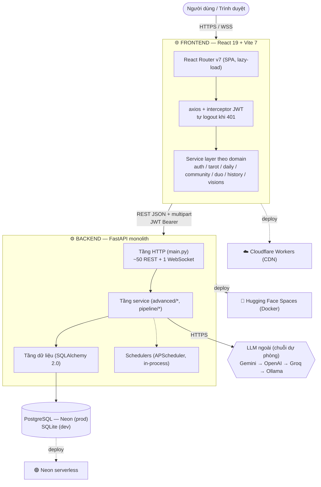
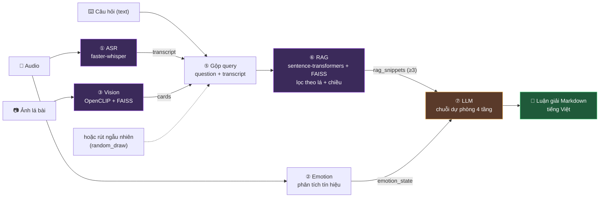
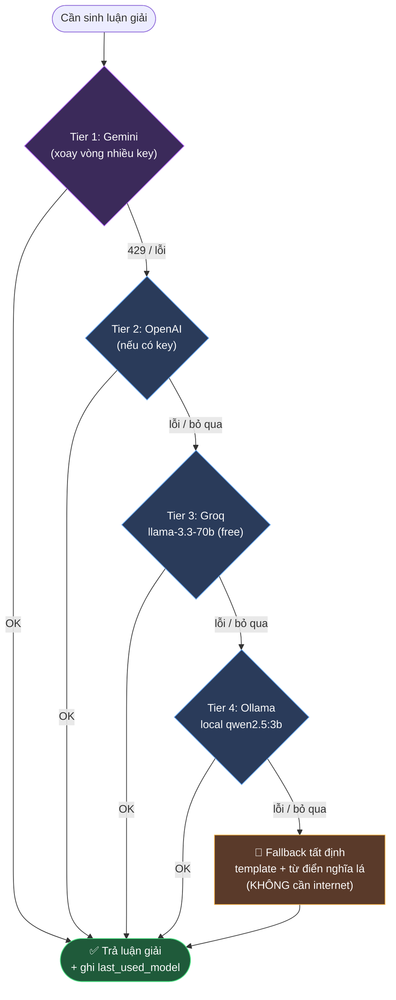
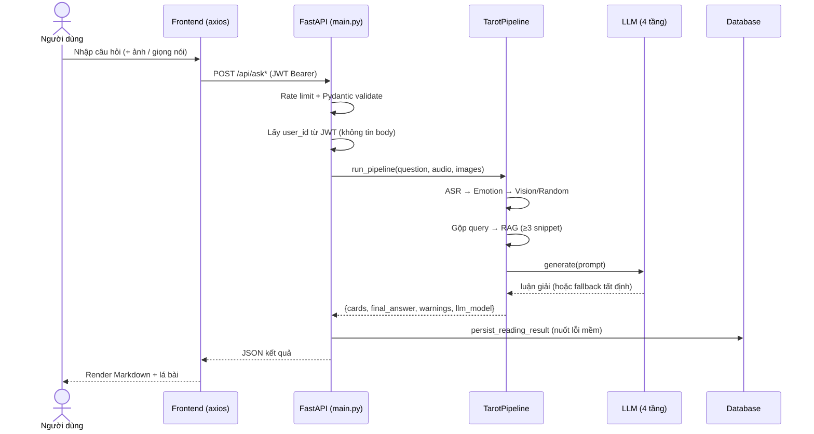
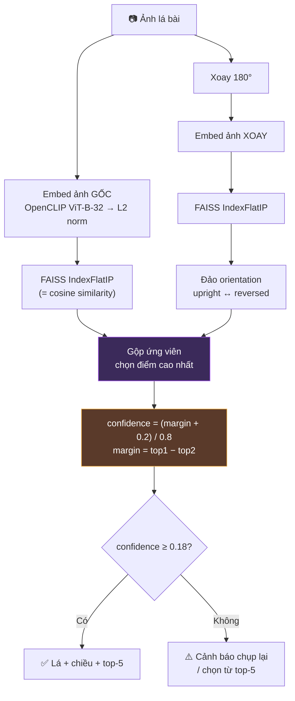
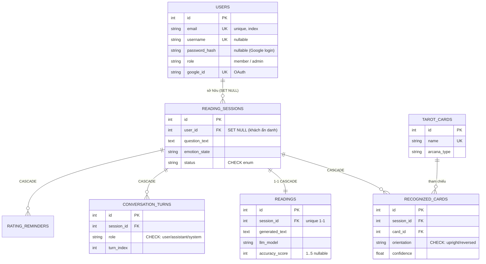
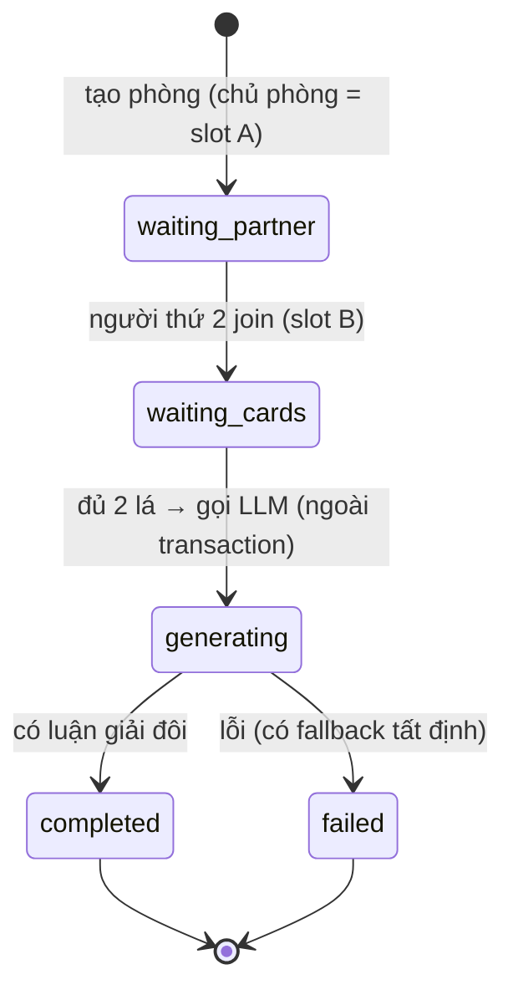
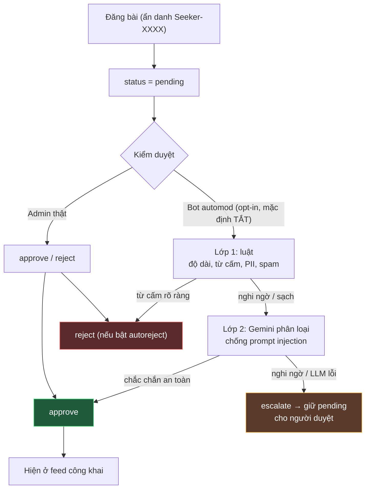
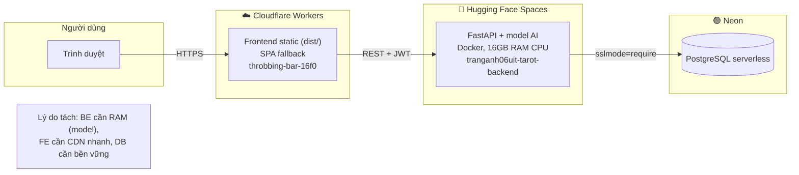

# Sơ đồ kiến trúc (Mermaid) — Tarot Multimodal Web App

> Dán các khối này vào báo cáo Markdown (GitHub/VS Code render trực tiếp), hoặc xem trong slide HTML.
> Mọi sơ đồ bám sát mã nguồn thực tế ở trạng thái bản final.

---

## 1. Kiến trúc tổng thể (3 hạ tầng tách rời)

---

## 2. Pipeline AI đa phương thức (7 bước của `run_pipeline`)

---

## 3. Điểm nhấn — Chuỗi dự phòng LLM 4 tầng (graceful degradation)

---

## 4. Luồng đọc bài (Sequence Diagram)

---

## 5. Vision — Nhận diện lá bài & lá ngược

---

## 6. ERD — Cụm lõi đọc bài (7 bảng chính)

---

## 7. Bản đồ 23 bảng theo cụm chức năng

---

## 8. Đọc bài đôi — máy trạng thái (State Diagram)

---

## 9. Cộng đồng + Auto-moderation (luồng kiểm duyệt)

---

## 10. Triển khai (Deploy) — 3 nơi vì 3 nhu cầu

---

## 11. Xác thực (Auth) — Login & Google OAuth

```mermaid
sequenceDiagram
    actor U as Người dùng
    participant FE as Frontend
    participant API as FastAPI
    participant G as Google

    rect rgb(40, 30, 60)
    note over U,API: Đăng nhập thường
    U->>FE: username/email + password
    FE->>API: POST /api/auth/login
    API->>API: verify PBKDF2 (200k vòng, compare_digest)
    API-->>FE: JWT HS256 (hạn 120 phút)
    end

    rect rgb(30, 40, 60)
    note over U,G: Đăng nhập Google
    U->>G: chọn tài khoản
    G-->>FE: id_token
    FE->>API: POST /api/auth/google
    API->>G: verify_oauth2_token(audience = GOOGLE_CLIENT_ID)
    G-->>API: payload (sub, email)
    API->>API: link google_id / tạo user (role member)
    API-->>FE: JWT
    end
```

