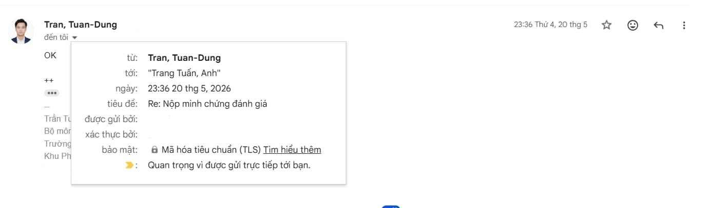

# [CATAROT] THÔNG TIN NỘP BÀI 
**Môn:** NT208.Q21.ANTN - Lập trình Ứng dụng Web 
**Lớp:** ATTN2024 
**GVHD:** ThS. Trần Tuấn Dũng 
**Sinh viên thực hiện:** Nguyễn Minh Phúc Khang (24520758), Trang Tuấn Anh (24520131) 

> **CATAROT** được triển khai tại: [**catarot.me**](https://catarot.me)

---

## Tỷ lệ đóng góp

| Phần công việc | Người phụ trách | Tỷ lệ |
| -------------- | --------------- | ----- | 
| Phát triển Backend, API và logic hệ thống | Tuấn Anh | 20% | 
| Cấu hình cơ sở dữ liệu | Tuấn Anh | 10% | 
| Đóng gói website thành ứng dụng Android dạng APK | Tuấn Anh | 10% |
| Deploy website | Tuấn Anh | 5% | 
| Lên ý tưởng và thiết kế giao diện | Phúc Khang | 20% | 
| Tích hợp Frontend với API và tối ưu trải nghiệm người dùng | Phúc Khang | 15% | 
| Chuẩn bị video demo tính năng và phỏng vấn khảo sát người dùng | Phúc Khang | 10% |
| Kiểm thử, phát hiện và sửa lỗi hệ thống sau khi triển khai | Tuấn Anh, Phúc Khang | 10% |
| **Tổng** |  | **100%** |

--- 

## Các tài nguyên khác
### 1. Demo tính năng CATAROT
> Link demo: [Drive](https://drive.google.com/drive/u/0/folders/1YfePSekVmbdltbwSN_VNRa2EUy1_lVk8) 

Các tính năng được nhóm demo:
- **DEMO 01:** Xác thực người dùng
- **DEMO 02:** Trải bài
- **DEMO 03:** Tarot hằng ngày
- **DEMO 04:** Phòng cộng đồng
- **DEMO 05:** Kho tầm nhìn
- **DEMO 06:** Trải bài đôi
- **DEMO 07:** Các tính năng phụ

*Video demo được thực hiện vào ngày 26/06/2026, trình bày các tính năng chính của hệ thống sau khi đã hoàn thiện.*

---

### 2. Phỏng vấn khảo sát người dùng 
> Link video phỏng vấn: [Tiktok](https://www.tiktok.com/@phuc.kane/video/7647152828934343956?is_from_webapp=1&sender_device=pc&web_id=7544383194390578696) 

*Video phỏng vấn được thực hiện vào ngày 03/06/2026, các hạn chế được nêu ra trong buổi phỏng vấn đã được nhóm khắc phục.*

---

### 3. CATAROT dành cho Android
Nhóm đã phát triển phiên bản **CATAROT** dành cho Android dưới dạng file APK. Ở phiên bản này, giao diện được thiết kế lại để phù hợp hơn với trải nghiệm trên thiết bị di động, giúp người dùng thao tác thuận tiện và trực quan hơn so với giao diện web. 

> Truy cập tại [catarot.apk](https://drive.google.com/file/d/1dT-3KA1HU891th71RXKiOeCdhEgM0wuv/view?usp=drive_link)

*Các chức năng chính của hệ thống vẫn được giữ đầy đủ như phiên bản web, được cập nhật theo phiên bản mới nhất ngày 29/06/2026.*

---

### 4. Minh chứng cộng điểm 
Do nhóm đã thực hiện phần đánh giá giảng viên trước thời điểm được yêu cầu chụp lại minh chứng, nên nhóm không còn ảnh chụp trực tiếp màn hình đánh giá. Tuy nhiên, các thành viên trong nhóm đã chủ động trao đổi lại với thầy thông qua email cũng như trong buổi báo cáo đồ án, và đã được thầy thông qua. 

**Tóm lượt nội dung đánh giá của nhóm:** giảng viên hướng dẫn nhiệt tình, có nhiều góp ý và định hướng hữu ích cho sinh viên; nội dung môn học có tính thực tiễn; quá trình thực hiện đồ án giúp nhóm hiểu rõ hơn về việc xây dựng và triển khai một hệ thống web hoàn chỉnh.

## 💌 Lời kết
Nhóm em xin gửi lời cảm ơn chân thành đến **ThS. Trần Tuấn Dũng** - người đã trực tiếp hướng dẫn nhóm trong suốt quá trình xây dựng website. Những góp ý và định hướng của thầy đã giúp nhóm có thêm nhiều góc nhìn mới trong việc thiết kế, hoàn thiện sản phẩm và hiểu rõ hơn cách một hệ thống web được xây dựng trong thực tế.

Thông qua đồ án **CATAROT**, nhóm em đã có cơ hội vận dụng các kiến thức đã học để xây dựng một hệ thống web hoàn chỉnh, từ thiết kế giao diện, xây dựng backend, tổ chức cơ sở dữ liệu, xử lý luồng người dùng đến triển khai ứng dụng. Bên cạnh đó, đồ án cũng giúp nhóm em hiểu rõ hơn cách tích hợp AI vào một sản phẩm web thực tế, cũng như cách các thành phần frontend, backend, database và dịch vụ triển khai phối hợp với nhau trong một hệ thống.

Mặc dù **CATAROT** đã được nhóm cố gắng xây dựng và hoàn thiện các chức năng chính theo mục tiêu ban đầu, dự án vẫn còn một số hạn chế nhất định về độ ổn định, hiệu năng và trải nghiệm người dùng. Do được phát triển trong phạm vi đồ án, hệ thống vẫn cần thêm thời gian để kiểm thử, tối ưu và hoàn thiện hơn. Trong tương lai, nhóm em mong muốn tiếp tục cải tiến sản phẩm, bổ sung các chức năng cần thiết và nâng cao chất lượng hệ thống để CATAROT có thể vận hành ổn định, thân thiện và hữu ích hơn trong thực tế.

> **Chúng em đã biết làm web và hiểu hệ thống web hoạt động như thế nào.**

